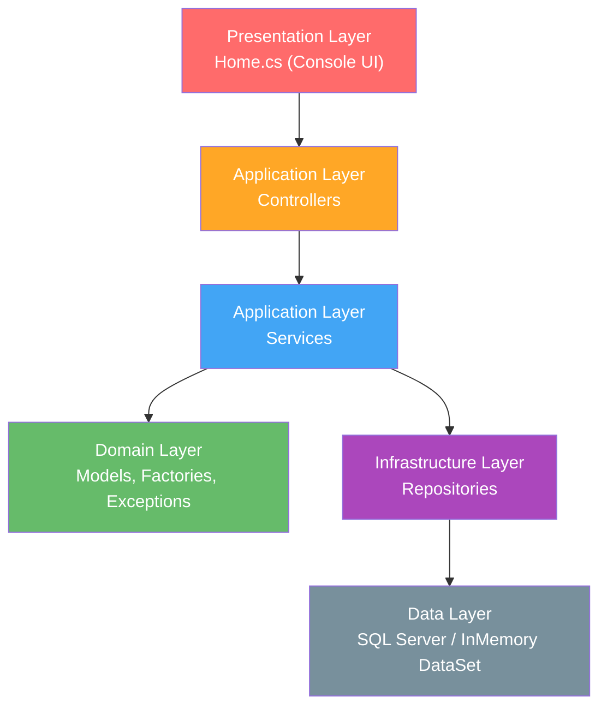
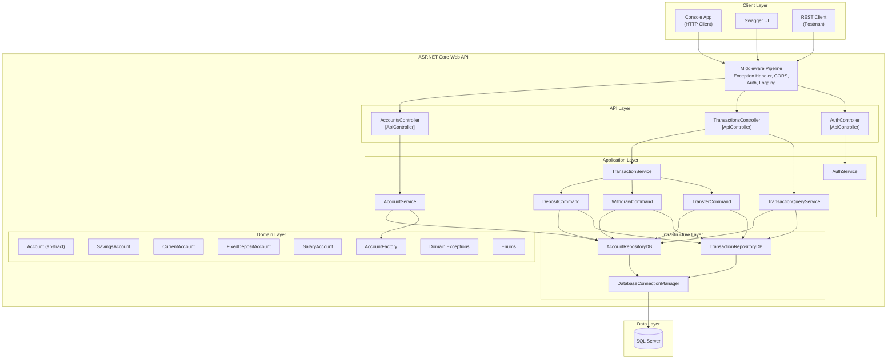
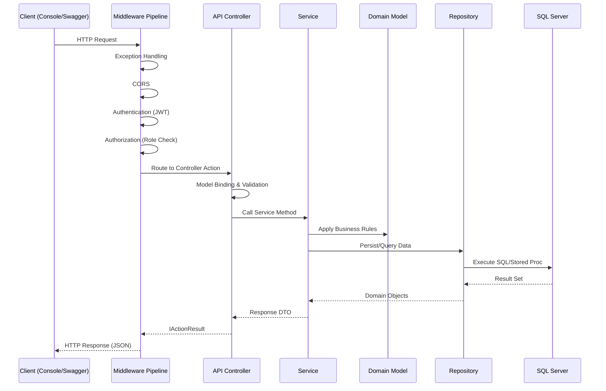
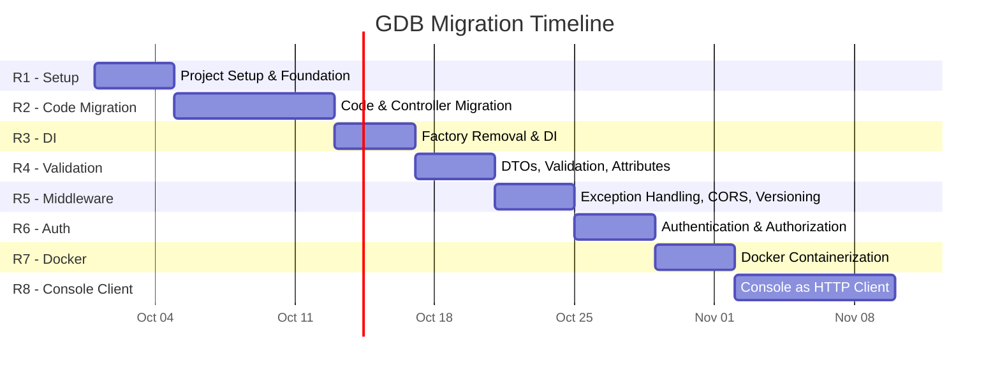

# GDB Console Application → ASP.NET Core Web API Migration Roadmap

## Comprehensive Engineering Execution Plan

---

# Section 1 — Executive Summary

## Project Objective

Migrate the **Global Digital Bank (GDB)** C# Console Application into a production-ready ASP.NET Core Web API while preserving all existing business logic, introducing RESTful HTTP endpoints, authentication/authorization, Docker containerization, and refactoring the console application into an HTTP client of the new API.

## Migration Scope

| Dimension | Scope |
|---|---|
| Source Application | .NET 8 Console Application (GDB.App) — Banking system with accounts, transactions, domain models, services, repositories, factories |
| Target Application | ASP.NET Core 8 Web API with layered architecture |
| Database | SQL Server (via stored procedures + raw ADO.NET) + InMemory DataSet fallback |
| Authentication | JWT Bearer with 4 roles: User, Manager, Teller, Admin |
| Containerization | Docker multi-stage build |
| Console Integration | Console app refactored as HTTP client of the Web API |
| Releases | 8 releases (R1–R8) |

## Target Architecture

Layered ASP.NET Core Web API: `API Controllers → Application Services → Domain Models → Infrastructure Repositories → SQL Server`

## Team Structure

| Metric | Value |
|---|---|
| Team Size | 3 developers (Dev A, Dev B, Dev C) |
| Sprint Duration | 4 working days |
| Hours/Developer/Day | 6 productive hours |
| Individual Sprint Capacity | 24 hours |
| Team Sprint Capacity | 72 person-hours |

## Release Strategy

| Release | Objective | Sprints |
|---|---|---|
| R1 | Project Setup & Foundation | Sprint 1 |
| R2 | Complete Code & Controller Migration | Sprint 2–3 |
| R3 | Factory Removal & DI | Sprint 4 |
| R4 | Models, DTOs, Validation, Attributes | Sprint 5 |
| R5 | Exception Handling, Middleware, CORS, Versioning | Sprint 6 |
| R6 | Authentication & Authorization | Sprint 7 |
| R7 | Docker Containerization | Sprint 8 |
| R8 | Console App as HTTP Client | Sprint 9–10 |

## Overall Timeline

| Metric | Value |
|---|---|
| Total Sprints | 10 |
| Total Calendar Days | 40 working days (8 weeks) |
| Total Estimated Effort | ~660 person-hours |
| Contingency Reserve | ~10% built into pessimistic estimates |

## Major Assumptions

1. SQL Server database already exists with stored procedures (`GetAccount`, `CreateAccount`, `InsertSavingsAccount`, etc.) and schema tables.
2. Team has access to SQL Server instance for development and testing.
3. .NET 8 SDK is installed on all development machines.
4. No external CI/CD pipeline is required for this migration phase — local Docker is sufficient.
5. The existing `AccountFactory` in the Domain layer is a legitimate domain pattern (not a DI substitute) and should be **preserved** in R3.
6. Role-permission mapping for User/Manager/Teller/Admin will require business confirmation — initial mapping is assumption-based.
7. The `PrivilegeFactory` class is currently empty and will remain a placeholder unless business requirements emerge.

---

# Section 2 — Existing Application Assessment

## 2.1 Existing Architecture

The GDB application follows a **layered console architecture** with clear separation of concerns:



## 2.2 Project Inventory

### Solution Structure
- **Solution File**: [GDB.App.slnx](file:///c:/GDB/gdb/GDB.App.slnx) — Contains single project `GDB.App.csproj`
- **Project File**: [GDB.App.csproj](file:///c:/GDB/gdb/GDB.App.csproj) — .NET 8, OutputType `Exe`
- **Target Framework**: `net8.0` with implicit usings and nullable enabled

### NuGet Dependencies
| Package | Version | Purpose |
|---|---|---|
| `System.Configuration.ConfigurationManager` | 10.0.12 | Read App.config connection strings |
| `System.Data.SqlClient` | 4.9.1 | Legacy SQL client (present but superseded) |
| `Microsoft.Data.SqlClient` | 7.1.0 | Primary SQL data provider |
| `Microsoft.Extensions.Configuration.Json` | 10.0.12 | JSON config support |
| `Microsoft.Extensions.Logging.Configuration` | 10.0.12 | Logging configuration |
| `Microsoft.Extensions.Logging.Console` | 10.0.12 | Console logging |
| `Serilog.Extensions.Logging` | 10.0.0 | Serilog integration |
| `Serilog.Settings.Configuration` | 10.0.1 | Serilog config |
| `Serilog.Sinks.Console` | 6.1.1 | Serilog console sink |
| `Serilog.Sinks.File` | 7.0.0 | Serilog file sink |

### Folder Structure (Source)
```
GDB.App/
├── Application/
│   ├── Controllers/
│   │   ├── AccountController.cs          (75 lines)
│   │   └── TransactionController.cs      (84 lines)
│   ├── Dtos/
│   │   ├── CloseAccountRequestDto.cs
│   │   ├── CloseAccountResponseDto.cs
│   │   ├── CreateAccountRequestDto.cs
│   │   ├── CreateAccountResponseDto.cs
│   │   ├── DepositResponseDto.cs
│   │   ├── TranferFundsResponseDto.cs
│   │   ├── TransactionDto.cs
│   │   ├── ViewAccountResponseDto.cs
│   │   ├── ViewAllAccountsResponseDto.cs
│   │   ├── ViewBalanceResponseDto.cs
│   │   ├── ViewRecentTransactionsResponseDto.cs
│   │   └── WithdrawResponseDto.cs
│   └── Services/
│       ├── Contracts/
│       │   ├── IAccountService.cs
│       │   ├── ITransactionCommand.cs
│       │   ├── ITransactionQueryService.cs
│       │   └── ITransactionService.cs
│       ├── Implementations/
│       │   ├── AccountService.cs          (399 lines)
│       │   ├── DepositTransactionCommand.cs
│       │   ├── TransactionQueryService.cs
│       │   ├── TransactionService.cs
│       │   ├── TransferTransactionCommand.cs
│       │   └── WithdrawTransactionCommand.cs
│       ├── AccountServiceFactory.cs
│       ├── TransactionCommandFactory.cs
│       ├── TransactionQueryServiceFactory.cs
│       └── TransactionServiceFactory.cs
├── Data/
│   └── GDBInMemoryDB.cs                  (671 lines)
├── Domain/
│   ├── Enums/
│   │   ├── AccountPrivilege.cs
│   │   ├── AccountStatus.cs
│   │   ├── AccountType.cs
│   │   ├── TransactionStatus.cs
│   │   └── TransactionType.cs
│   ├── Exceptions/
│   │   ├── AccountException.cs
│   │   ├── InactiveAccountException.cs
│   │   ├── InsufficeintBalanceException.cs
│   │   ├── InvalidAmountException.cs
│   │   ├── InvalidPinException.cs
│   │   └── MinimumBalanceViolationException.cs
│   ├── Models/
│   │   ├── IAccount.cs
│   │   ├── Account.cs (abstract base)
│   │   ├── SavingsAccount.cs
│   │   ├── CurrentAccount.cs
│   │   ├── FixedDepositAccount.cs
│   │   └── SalaryAccount.cs
│   ├── AccountFactory.cs
│   └── PrivilegeFactory.cs (empty)
├── Infrastructure/
│   └── Repositories/
│       ├── Contracts/
│       │   ├── IAccountRepository.cs
│       │   └── ITransactionRepository.cs
│       ├── Implementations/
│       │   ├── AccountRepositoryDB.cs     (872 lines)
│       │   ├── AccountRepositoryInMemory.cs
│       │   ├── TransactionRepositoryDB.cs
│       │   ├── TransactionRepositoryInMemory.cs
│       │   └── PrivilegeRepository.cs
│       ├── Queries/
│       │   ├── AccountQueries.cs
│       │   └── TransactionQueries.cs
│       ├── AccountRepositoryFactory.cs
│       ├── TransactionRepositoryFactory.cs
│       ├── DataBaseConnectionManager.cs
│       ├── DataBaseProviderRegistration.cs
│       └── GDBInMemoryDataStore.cs
├── Logging/
│   ├── AppLogger.cs
│   ├── ConfiguredLogger.cs
│   ├── FileLogger.cs
│   └── LoggingSample.cs
├── Presentation/
│   └── UI/
│       ├── Home.cs                        (621 lines)
│       ├── DBTesting.cs (commented out)
│       └── TestAbstractAccount.cs (entry point)
├── App.config
├── appsettings.json
└── GDB.App.csproj
```

## 2.3 Business Functionality Inventory

| # | Console Operation | Current Flow | Controller Method | Service Method |
|---|---|---|---|---|
| 1 | Create Account | Console → AccountController → AccountService → AccountFactory → AccountRepositoryDB | `CreateAccount(CreateAccountRequestDto)` | `CreateAccount(CreateAccountRequestDto)` |
| 2 | View Account | Console → AccountController → AccountService → AccountRepositoryDB | `ViewAccountAsync(string)` | `ViewAccountAsync(string)` |
| 3 | View All Accounts | Console → AccountController → AccountService → AccountRepositoryDB | `GetAllAccounts()` | `GetAllAccounts()` |
| 4 | View Balance | Console → AccountController → AccountService → AccountRepositoryDB | `GetBalanceAsync(string)` | `GetBalanceAsync(string)` |
| 5 | View Recent Transactions | Console → TransactionController → TransactionQueryService → TransactionRepositoryDB | `GetRecentTransactionsAsync(string)` | `GetRecentTransactionsAsync(string)` |
| 6 | Withdraw | Console → TransactionController → TransactionService → WithdrawTransactionCommand → Repos | `WithdrawAsync(string, string, decimal)` | `ProcessTransactionAsync<WithdrawResponseDto>(...)` |
| 7 | Deposit | Console → TransactionController → TransactionService → DepositTransactionCommand → Repos | `DepositAsync(string, decimal)` | `ProcessTransactionAsync<DepositResponseDto>(...)` |
| 8 | Transfer Funds | Console → TransactionController → TransactionService → TransferTransactionCommand → Repos | `TransferFundsAsync(string, string, string, decimal)` | `ProcessTransactionAsync<TranferFundsResponseDto>(...)` |
| 9 | Close Account | Console → AccountController → AccountService → AccountRepositoryDB | `CloseAccountAsync(CloseAccountRequestDto)` | `CloseAccountAsync(CloseAccountRequestDto)` |

## 2.4 Design Patterns Identified

| Pattern | Where Used | Migration Impact |
|---|---|---|
| **Factory Method** | `AccountFactory`, `AccountRepositoryFactory`, `TransactionRepositoryFactory`, `AccountServiceFactory`, `TransactionServiceFactory`, `TransactionQueryServiceFactory`, `TransactionCommandFactory` | Repository & Service factories → Replace with DI. Domain `AccountFactory` → Preserve (domain logic). |
| **Template Method** | `Account.Withdraw()` → `ProcessDebit()` (abstract) | Preserve as-is (domain responsibility) |
| **Command Pattern** | `ITransactionCommand<TResponse>` with `DepositTransactionCommand`, `WithdrawTransactionCommand`, `TransferTransactionCommand` | Preserve pattern, inject dependencies via DI |
| **Strategy Pattern** | `IAccountRepository` with DB/InMemory implementations | Preserve, configure via DI |
| **Repository Pattern** | `IAccountRepository`, `ITransactionRepository` | Preserve, register in DI |

## 2.5 Technical Debt Identified

| ID | Issue | Severity | Location |
|---|---|---|---|
| TD-1 | `AccountService` is `internal` — prevents DI registration from API project | Medium | [AccountService.cs:44](file:///c:/GDB/gdb/Application/Services/Implementations/AccountService.cs#L44) |
| TD-2 | `AccountRepositoryDB` is `internal` — same issue | Medium | [AccountRepositoryDB.cs:13](file:///c:/GDB/gdb/Infrastructure/Repositories/Implementations/AccountRepositoryDB.cs#L13) |
| TD-3 | `AccountRepositoryFactory` is package-private (`class` without modifier) | Low | [AccountRepositoryFactory.cs:18](file:///c:/GDB/gdb/Infrastructure/Repositories/AccountRepositoryFactory.cs#L18) |
| TD-4 | `CreateAccount` uses `.GetAwaiter().GetResult()` — blocking async-over-sync | High | [AccountService.cs:329](file:///c:/GDB/gdb/Application/Services/Implementations/AccountService.cs#L329) |
| TD-5 | `PrivilegeFactory` is empty — dead code | Low | [PrivilegeFactory.cs](file:///c:/GDB/gdb/Domain/PrivilegeFactory.cs) |
| TD-6 | `PrivilegeRepository` has only static data, no interface | Low | [PrivilegeRepository.cs](file:///c:/GDB/gdb/Infrastructure/Repositories/Implementations/PrivilegeRepository.cs) |
| TD-7 | `DBTesting.cs` is entirely commented out | Low | [DBTesting.cs](file:///c:/GDB/gdb/Presentation/UI/DBTesting.cs) |
| TD-8 | Duplicate SQL client packages (`System.Data.SqlClient` + `Microsoft.Data.SqlClient`) | Low | [GDB.App.csproj:12-13](file:///c:/GDB/gdb/GDB.App.csproj#L12-L13) |
| TD-9 | Connection string uses `ConfigurationManager` (App.config) — not ASP.NET Core compatible | High | [DataBaseConnectionManager.cs:20](file:///c:/GDB/gdb/Infrastructure/Repositories/DataBaseConnectionManager.cs#L20) |
| TD-10 | Typo in filename: `InsufficeintBalanceException.cs` | Low | [InsufficeintBalanceException.cs](file:///c:/GDB/gdb/Domain/Exceptions/InsufficeintBalanceException.cs) |
| TD-11 | `GetAllAccounts()` is synchronous while other repo methods are async | Medium | [IAccountService.cs:25](file:///c:/GDB/gdb/Application/Services/Contracts/IAccountService.cs#L25) |
| TD-12 | `ViewAllAccountsResponseDto` has `AccountStatus` property but `Home.cs` reads it as field — field never set in service | Medium | [ViewAllAccountsResponseDto.cs:20](file:///c:/GDB/gdb/Application/Dtos/ViewAllAccountsResponseDto.cs#L20) |

## 2.6 Database Architecture

- **Primary**: SQL Server with stored procedures (`GetAccount`, `CreateAccount`, `InsertSavingsAccount`, `InsertCurrentAccount`, `InsertFixedDepositAccount`, `InsertSalaryAccount`)
- **Fallback**: InMemory DataSet (`GDBInMemoryDB`) with 12 sample accounts
- **Connection**: Via `DbProviderFactory` abstraction, configured in `App.config`
- **Tables**: `Accounts`, `AccountTypes`, `AccountStatuses`, `AccountPrivileges`, `SavingsAccounts`, `CurrentAccounts`, `FixedDepositAccounts`, `SalaryAccounts`, `Transactions`, `TransactionTypes`, `TransactionStatuses`

---

# Section 3 — Target Architecture

## 3.1 Proposed Architecture



## 3.2 Proposed Solution Structure

```
GDB/
├── GDB.sln
├── src/
│   ├── GDB.Api/                          # ASP.NET Core Web API Project (NEW)
│   │   ├── Controllers/
│   │   │   ├── AccountsController.cs     # REST API Controllers
│   │   │   ├── TransactionsController.cs
│   │   │   └── AuthController.cs
│   │   ├── Middleware/
│   │   │   └── GlobalExceptionHandler.cs
│   │   ├── Configuration/
│   │   │   └── ServiceRegistration.cs    # DI configuration
│   │   ├── Program.cs
│   │   ├── appsettings.json
│   │   ├── appsettings.Development.json
│   │   ├── Dockerfile
│   │   └── .dockerignore
│   │
│   └── GDB.App/                          # Existing Console App (Modified to HTTP Client in R8)
│       ├── Application/
│       │   ├── Controllers/              # Preserved for backward compat until R8
│       │   ├── Dtos/                     # Shared DTOs
│       │   └── Services/                 # Business logic
│       ├── Domain/                       # Domain models, factories, exceptions
│       ├── Infrastructure/               # Repositories, DB access
│       ├── Data/                         # InMemory data store
│       ├── Logging/                      # Logging infrastructure
│       └── Presentation/                 # Console UI (refactored in R8)
│
└── docker-compose.yml (optional)
```

## 3.3 Component Migration Mapping

| Existing Component | Target Location | Migration Action |
|---|---|---|
| `Presentation/UI/Home.cs` | `GDB.App/Presentation/UI/Home.cs` | Refactor to HTTP client (R8) |
| `Presentation/UI/TestAbstractAccount.cs` | `GDB.App/Program.cs` | Simplify entry point |
| `Application/Controllers/AccountController.cs` | `GDB.Api/Controllers/AccountsController.cs` | Replace with ASP.NET Core ApiController |
| `Application/Controllers/TransactionController.cs` | `GDB.Api/Controllers/TransactionsController.cs` | Replace with ASP.NET Core ApiController |
| `Application/Services/*` | `GDB.App/Application/Services/*` | Modify access modifiers, add DI constructors |
| `Application/Dtos/*` | `GDB.App/Application/Dtos/*` | Add validation attributes (R4) |
| `Domain/*` | `GDB.App/Domain/*` | Reuse without modification |
| `Infrastructure/Repositories/*` | `GDB.App/Infrastructure/Repositories/*` | Modify connection management for DI |
| `Logging/*` | `GDB.Api/` (via ASP.NET Core logging) | Replace static loggers with DI-injected ILogger |
| `Data/GDBInMemoryDB.cs` | `GDB.App/Data/GDBInMemoryDB.cs` | Reuse without modification |
| `App.config` | `GDB.Api/appsettings.json` | Migrate connection strings |
| Service Factories | Removed in R3 | Replace with DI service registration |
| Repository Factories | Removed in R3 | Replace with DI service registration |

## 3.4 API Request Lifecycle



## 3.5 Architectural Decision Records

| ADR | Decision | Rationale |
|---|---|---|
| ADR-1 | **Two-project solution** (GDB.Api + GDB.App) rather than multi-project layered split | The existing codebase is ~3000 LOC. Splitting into 5+ class libraries would add unnecessary complexity. The API project references the existing project. |
| ADR-2 | **Preserve `AccountFactory`** as domain logic | The `AccountFactory` implements legitimate domain polymorphism (4 account types with type-specific parameters). It is not a DI substitute. |
| ADR-3 | **Remove service/repository factories**, replace with DI | `AccountServiceFactory`, `TransactionServiceFactory`, `AccountRepositoryFactory`, `TransactionRepositoryFactory` exist solely to construct dependencies — this is DI's responsibility. |
| ADR-4 | **Keep ADO.NET with stored procedures** — do not introduce EF Core | The existing data access uses raw `DbCommand` with stored procedures. Introducing EF Core would be a second migration inside this migration. |
| ADR-5 | **JWT Bearer authentication** with role claims | Suitable for stateless API authentication with four defined roles. |
| ADR-6 | **Modify `DataBaseConnectionManager`** to accept connection string via DI | Currently reads from `App.config` via `ConfigurationManager` — incompatible with ASP.NET Core. |
| ADR-7 | **Keep `ITransactionCommand<T>` pattern** | The command pattern is well-implemented and supports the three transaction types cleanly. DI will inject the repositories. |

---

# Section 4 — Migration Strategy

## 4.1 Migration Principles

1. **Incremental delivery**: Each release produces a verifiable, running application.
2. **Preserve before transform**: Copy/reference existing code before refactoring.
3. **Business logic preservation**: Domain layer remains untouched unless access modifiers need changing.
4. **Backward compatibility**: Console app continues to work directly until R8 when it becomes an HTTP client.
5. **Test at every boundary**: Verify each migrated component before proceeding.

## 4.2 Migration Sequence



## 4.3 Code Classification Summary

| Classification | Count | Components |
|---|---|---|
| **1. Reuse without modification** | 17 | Domain Models (6), Enums (5), Exceptions (6) |
| **2. Reuse with minor modifications** | 12 | DTOs (12) — add validation attributes in R4 |
| **3. Refactor before migration** | 8 | AccountService, TransactionQueryService, AccountRepositoryDB, TransactionRepositoryDB, DataBaseConnectionManager, DataBaseProviderRegistration, DepositTransactionCommand, WithdrawTransactionCommand, TransferTransactionCommand — change access modifiers, add DI constructors |
| **4. Replace with ASP.NET Core** | 2 | AccountController → API Controller, TransactionController → API Controller |
| **5. Move to another layer** | 0 | — |
| **6. Remove** | 7 | AccountServiceFactory, TransactionServiceFactory, TransactionQueryServiceFactory, TransactionCommandFactory, AccountRepositoryFactory, TransactionRepositoryFactory, DBTesting.cs |
| **7. Introduce new** | 8 | API Project, Program.cs, AuthController, AuthService, GlobalExceptionHandler, ServiceRegistration, Dockerfile, docker-compose.yml |

---

# Section 5 — Complete Work Breakdown Structure

## Level 1: GDB Migration Program

### Level 2: R1 — Project Setup and Foundation

#### L3: E1.1 — Repository and Git Setup
- **F1.1.1** — Repository assessment and branch strategy
  - T1.1.1.1 — Inspect existing repository, branches, commit history
  - T1.1.1.2 — Define Git workflow: `main` → `develop` → `feature/*` → `release/*`
  - T1.1.1.3 — Define commit conventions (conventional commits)
  - T1.1.1.4 — Define code review checklist and PR process
  - T1.1.1.5 — Create `develop` branch from `main`

#### L3: E1.2 — ASP.NET Core Project Creation
- **F1.2.1** — Create Web API project
  - T1.2.1.1 — Create new solution file `GDB.sln`
  - T1.2.1.2 — Create `GDB.Api` Web API project (net8.0)
  - T1.2.1.3 — Add `GDB.App.csproj` to the new solution
  - T1.2.1.4 — Add project reference: `GDB.Api` → `GDB.App`
  - T1.2.1.5 — Remove `OutputType Exe` from `GDB.App.csproj` (make it a class library)
  - T1.2.1.6 — Move/copy entry point logic to `GDB.Api/Program.cs`
  - T1.2.1.7 — Verify both projects build successfully
- **F1.2.2** — NuGet dependency setup
  - T1.2.2.1 — Add required NuGet packages to `GDB.Api` (Swashbuckle, Serilog.AspNetCore)
  - T1.2.2.2 — Verify package compatibility with .NET 8
  - T1.2.2.3 — Remove `System.Data.SqlClient` from `GDB.App` (keep only `Microsoft.Data.SqlClient`)

#### L3: E1.3 — API Foundation Configuration
- **F1.3.1** — Program.cs and startup configuration
  - T1.3.1.1 — Configure `Program.cs` with `WebApplication.CreateBuilder`
  - T1.3.1.2 — Add controller services (`builder.Services.AddControllers()`)
  - T1.3.1.3 — Configure JSON serialization (System.Text.Json options)
  - T1.3.1.4 — Configure Swagger/OpenAPI
  - T1.3.1.5 — Configure middleware pipeline ordering
  - T1.3.1.6 — Add `appsettings.json` with connection string (migrated from App.config)
  - T1.3.1.7 — Add `appsettings.Development.json`
  - T1.3.1.8 — Update `.gitignore` for ASP.NET Core patterns
- **F1.3.2** — Hello World verification
  - T1.3.2.1 — Create temporary `HealthController` with `GET /api/health`
  - T1.3.2.2 — Run application, verify Swagger UI loads
  - T1.3.2.3 — Verify endpoint returns 200 OK
  - T1.3.2.4 — Initial Git commit on `develop` branch

### Level 2: R2 — Complete Code Migration and Controller Migration

#### L3: E2.1 — Access Modifier and Namespace Preparation
- **F2.1.1** — Fix access modifiers for DI compatibility
  - T2.1.1.1 — Change `AccountService` from `internal` to `public`
  - T2.1.1.2 — Change `AccountRepositoryDB` from `internal` to `public`
  - T2.1.1.3 — Change `AccountRepositoryFactory` from package-private to `public`
  - T2.1.1.4 — Verify build still succeeds
  - T2.1.1.5 — Run console app to confirm no regression

#### L3: E2.2 — Account API Controller Migration
- **F2.2.1** — AccountsController implementation
  - T2.2.1.1 — Create `GDB.Api/Controllers/AccountsController.cs` with `[ApiController]` and `[Route("api/[controller]")]`
  - T2.2.1.2 — Implement `GET /api/accounts/{accountNumber}` → calls `IAccountService.ViewAccountAsync`
  - T2.2.1.3 — Implement `GET /api/accounts` → calls `IAccountService.GetAllAccounts`
  - T2.2.1.4 — Implement `GET /api/accounts/{accountNumber}/balance` → calls `IAccountService.GetBalanceAsync`
  - T2.2.1.5 — Implement `POST /api/accounts` → calls `IAccountService.CreateAccount`
  - T2.2.1.6 — Implement `DELETE /api/accounts/{accountNumber}` → calls `IAccountService.CloseAccountAsync`
  - T2.2.1.7 — Add appropriate HTTP status codes (200, 201, 400, 404)
  - T2.2.1.8 — Test all Account endpoints via Swagger

#### L3: E2.3 — Transaction API Controller Migration
- **F2.3.1** — TransactionsController implementation
  - T2.3.1.1 — Create `GDB.Api/Controllers/TransactionsController.cs` with `[ApiController]`
  - T2.3.1.2 — Implement `POST /api/transactions/deposit` → calls `ITransactionService.ProcessTransactionAsync<DepositResponseDto>`
  - T2.3.1.3 — Implement `POST /api/transactions/withdraw` → calls `ITransactionService.ProcessTransactionAsync<WithdrawResponseDto>`
  - T2.3.1.4 — Implement `POST /api/transactions/transfer` → calls `ITransactionService.ProcessTransactionAsync<TranferFundsResponseDto>`
  - T2.3.1.5 — Implement `GET /api/transactions/{accountNumber}/recent` → calls `ITransactionQueryService.GetRecentTransactionsAsync`
  - T2.3.1.6 — Add appropriate HTTP status codes
  - T2.3.1.7 — Test all Transaction endpoints via Swagger

#### L3: E2.4 — Temporary Service Wiring
- **F2.4.1** — Register services using existing factories (temporary, removed in R3)
  - T2.4.1.1 — Register `IAccountService` using `AccountServiceFactory.Create()`
  - T2.4.1.2 — Register `ITransactionService` using `TransactionServiceFactory.Create()`
  - T2.4.1.3 — Register `ITransactionQueryService` using `TransactionQueryServiceFactory.Create()`
  - T2.4.1.4 — Verify all endpoints work end-to-end with database
  - T2.4.1.5 — Perform regression testing against console app behavior

#### L3: E2.5 — Database Connectivity Verification
- **F2.5.1** — Connection string migration
  - T2.5.1.1 — Add `GDBConnection` connection string to `appsettings.json`
  - T2.5.1.2 — Verify `DataBaseConnectionManager` works from API context
  - T2.5.1.3 — Test Create Account end-to-end
  - T2.5.1.4 — Test Deposit end-to-end
  - T2.5.1.5 — Test Withdraw end-to-end
  - T2.5.1.6 — Test Transfer end-to-end
  - T2.5.1.7 — Test View Recent Transactions end-to-end
  - T2.5.1.8 — Test Close Account end-to-end

### Level 2: R3 — Factory Removal and Dependency Injection

#### L3: E3.1 — Repository DI Registration
- **F3.1.1** — Replace repository factories with DI
  - T3.1.1.1 — Refactor `DataBaseConnectionManager` to accept connection string via constructor/configuration
  - T3.1.1.2 — Register `IAccountRepository` → `AccountRepositoryDB` as Scoped
  - T3.1.1.3 — Register `ITransactionRepository` → `TransactionRepositoryDB` as Scoped
  - T3.1.1.4 — Remove `AccountRepositoryFactory` usage from services
  - T3.1.1.5 — Remove `TransactionRepositoryFactory` usage from services

#### L3: E3.2 — Service DI Registration
- **F3.2.1** — Replace service factories with DI
  - T3.2.1.1 — Add `IAccountRepository` constructor parameter to `AccountService`
  - T3.2.1.2 — Add constructor parameters to `TransactionQueryService`
  - T3.2.1.3 — Register `IAccountService` → `AccountService` as Scoped
  - T3.2.1.4 — Register `ITransactionService` → `TransactionService` as Scoped
  - T3.2.1.5 — Register `ITransactionQueryService` → `TransactionQueryService` as Scoped
  - T3.2.1.6 — Register transaction commands (Deposit, Withdraw, Transfer) as Scoped
  - T3.2.1.7 — Refactor `TransactionService` to use DI instead of `TransactionCommandFactory`
  - T3.2.1.8 — Remove all factory classes (6 factories total)
  - T3.2.1.9 — Create `ServiceRegistration.cs` extension method for clean DI setup

#### L3: E3.3 — DI Verification
- **F3.3.1** — Validate complete DI chain
  - T3.3.1.1 — Verify application starts without DI resolution errors
  - T3.3.1.2 — Test every endpoint to confirm behavior unchanged
  - T3.3.1.3 — Verify service lifetimes are correct (no captive dependency issues)
  - T3.3.1.4 — Verify database connections are properly disposed

### Level 2: R4 — Models, DTOs, Validation, and Attributes

#### L3: E4.1 — Request DTO Validation
- **F4.1.1** — Add validation attributes to CreateAccountRequestDto
  - T4.1.1.1 — Add `[Required]` to `AccountNumber`, `Name`, `Pin`
  - T4.1.1.2 — Add `[StringLength(10, MinimumLength = 10)]` to `AccountNumber`
  - T4.1.1.3 — Add `[StringLength(4, MinimumLength = 4)]` to `Pin`
  - T4.1.1.4 — Add `[Range(18, 120)]` to `Age`
  - T4.1.1.5 — Add `[Range(0.01, double.MaxValue)]` to `Balance`
  - T4.1.1.6 — Add `[Required]` to `AccountType`, `Status`, `Privilege`

- **F4.1.2** — Add validation attributes to other request DTOs
  - T4.1.2.1 — Add `[Required]` to `CloseAccountRequestDto.AccountNumber`
  - T4.1.2.2 — Add validation to `TransactionDto` (Required AccountNumber, Amount range)
  - T4.1.2.3 — Create `DepositRequestDto` (separate from internal TransactionDto)
  - T4.1.2.4 — Create `WithdrawRequestDto` with Pin validation
  - T4.1.2.5 — Create `TransferRequestDto` with From/To/Pin/Amount validation

#### L3: E4.2 — Response DTO Refinement
- **F4.2.1** — Standardize response DTOs
  - T4.2.1.1 — Create `ApiResponse<T>` wrapper with `Success`, `Data`, `Errors` fields
  - T4.2.1.2 — Update controllers to return `ApiResponse<T>` consistently
  - T4.2.1.3 — Verify all endpoints return consistent response structure

#### L3: E4.3 — Model Validation Pipeline
- **F4.3.1** — Configure automatic model validation
  - T4.3.1.1 — Verify `[ApiController]` automatic 400 response behavior
  - T4.3.1.2 — Customize `InvalidModelStateResponseFactory` for consistent error format
  - T4.3.1.3 — Test with invalid payloads (missing required fields, out-of-range values)
  - T4.3.1.4 — Test with valid payloads to confirm no regression

### Level 2: R5 — Global Exception Handling, Middleware, CORS, API Versioning

#### L3: E5.1 — Global Exception Handling
- **F5.1.1** — Create exception handling middleware
  - T5.1.1.1 — Create `GlobalExceptionHandler` implementing `IExceptionHandler`
  - T5.1.1.2 — Map `AccountException` → 400 Bad Request
  - T5.1.1.3 — Map `InactiveAccountException` → 409 Conflict
  - T5.1.1.4 — Map `InsufficientBalanceException` → 422 Unprocessable Entity
  - T5.1.1.5 — Map `InvalidAmountException` → 400 Bad Request
  - T5.1.1.6 — Map `InvalidPinException` → 401 Unauthorized
  - T5.1.1.7 — Map `MinimumBalanceViolationException` → 422 Unprocessable Entity
  - T5.1.1.8 — Map `InvalidOperationException` → 409 Conflict
  - T5.1.1.9 — Map unhandled exceptions → 500 Internal Server Error
  - T5.1.1.10 — Return `ProblemDetails` format for all errors
  - T5.1.1.11 — Add structured logging for all exceptions

#### L3: E5.2 — CORS Configuration
- **F5.2.1** — Configure CORS policy
  - T5.2.1.1 — Add CORS services with named policy
  - T5.2.1.2 — Configure allowed origins (development: `*`, production: specific)
  - T5.2.1.3 — Configure allowed methods and headers
  - T5.2.1.4 — Add CORS middleware to pipeline

#### L3: E5.3 — API Versioning
- **F5.3.1** — Implement URL-based API versioning
  - T5.3.1.1 — Add `Asp.Versioning.Http` NuGet package
  - T5.3.1.2 — Configure API versioning in `Program.cs`
  - T5.3.1.3 — Add `[ApiVersion("1.0")]` to all controllers
  - T5.3.1.4 — Update routes to `api/v{version:apiVersion}/[controller]`
  - T5.3.1.5 — Configure Swagger to show version info
  - T5.3.1.6 — Test versioned endpoints

#### L3: E5.4 — Middleware Pipeline Verification
- **F5.4.1** — Verify middleware ordering and behavior
  - T5.4.1.1 — Test exception handling with domain exceptions
  - T5.4.1.2 — Test CORS with cross-origin requests
  - T5.4.1.3 — Test API versioning with versioned URLs
  - T5.4.1.4 — Test negative scenarios (invalid requests, server errors)

### Level 2: R6 — Authentication and Authorization

#### L3: E6.1 — JWT Authentication Setup
- **F6.1.1** — Configure JWT Bearer authentication
  - T6.1.1.1 — Add `Microsoft.AspNetCore.Authentication.JwtBearer` NuGet package
  - T6.1.1.2 — Add JWT configuration section to `appsettings.json`
  - T6.1.1.3 — Configure JWT authentication in `Program.cs`
  - T6.1.1.4 — Configure token validation parameters
  - T6.1.1.5 — Add authentication middleware to pipeline

#### L3: E6.2 — Token Generation
- **F6.2.1** — Implement auth service and controller
  - T6.2.1.1 — Create `IAuthService` interface
  - T6.2.1.2 — Create `AuthService` with `GenerateToken` method
  - T6.2.1.3 — Create `LoginRequestDto` and `LoginResponseDto`
  - T6.2.1.4 — Create `AuthController` with `POST /api/auth/login`
  - T6.2.1.5 — Implement hardcoded user store (for this phase, not production)
  - T6.2.1.6 — Include role claims in JWT token
  - T6.2.1.7 — Configure token expiration

#### L3: E6.3 — Role-Based Authorization
- **F6.3.1** — Apply authorization attributes to endpoints
  - T6.3.1.1 — Define role-permission matrix
  - T6.3.1.2 — Add `[Authorize]` to all protected endpoints
  - T6.3.1.3 — Add `[Authorize(Roles = "Admin")]` to admin-only endpoints
  - T6.3.1.4 — Add `[Authorize(Roles = "Teller,Admin")]` to teller endpoints
  - T6.3.1.5 — Add `[AllowAnonymous]` to auth endpoints and health check
  - T6.3.1.6 — Configure Swagger to accept JWT tokens
  - T6.3.1.7 — Test authorized access for each role
  - T6.3.1.8 — Test unauthorized access (401)
  - T6.3.1.9 — Test forbidden access (403)

#### Role-Permission Matrix (Assumption — requires business confirmation)

| Operation | User | Teller | Manager | Admin |
|---|:---:|:---:|:---:|:---:|
| View Own Account | ✅ | ✅ | ✅ | ✅ |
| View All Accounts | ❌ | ✅ | ✅ | ✅ |
| View Balance | ✅ | ✅ | ✅ | ✅ |
| Create Account | ❌ | ✅ | ✅ | ✅ |
| Close Account | ❌ | ❌ | ✅ | ✅ |
| Deposit | ✅ | ✅ | ✅ | ✅ |
| Withdraw | ✅ | ✅ | ✅ | ✅ |
| Transfer | ✅ | ✅ | ✅ | ✅ |
| View Transactions | ✅ | ✅ | ✅ | ✅ |
| Login | ✅ | ✅ | ✅ | ✅ |

> [!IMPORTANT]
> This role-permission matrix is an assumption. The existing application has no authentication — all operations are available to all users. Business stakeholders must confirm the intended access control.

### Level 2: R7 — Docker Containerization

#### L3: E7.1 — Dockerfile Creation
- **F7.1.1** — Multi-stage Dockerfile
  - T7.1.1.1 — Create `Dockerfile` with SDK build stage
  - T7.1.1.2 — Add runtime stage with `mcr.microsoft.com/dotnet/aspnet:8.0`
  - T7.1.1.3 — Configure `EXPOSE` for port 8080
  - T7.1.1.4 — Create `.dockerignore`
  - T7.1.1.5 — Build Docker image locally
  - T7.1.1.6 — Verify image builds successfully

#### L3: E7.2 — Container Configuration
- **F7.2.1** — Environment and networking
  - T7.2.1.1 — Configure environment variables for connection string
  - T7.2.1.2 — Configure container port mapping
  - T7.2.1.3 — Add health check endpoint (`/api/health`)
  - T7.2.1.4 — Create `docker-compose.yml` (optional — for DB + API)
  - T7.2.1.5 — Test container startup
  - T7.2.1.6 — Test API endpoints from host machine
  - T7.2.1.7 — Test database connectivity from container
  - T7.2.1.8 — Document Docker commands

### Level 2: R8 — Console Application as HTTP Client

#### L3: E8.1 — HTTP Client Infrastructure
- **F8.1.1** — Configure HttpClient
  - T8.1.1.1 — Add `Microsoft.Extensions.Http` to `GDB.App`
  - T8.1.1.2 — Create `IGdbApiClient` interface
  - T8.1.1.3 — Create `GdbApiClient` typed HTTP client class
  - T8.1.1.4 — Configure base URL from configuration
  - T8.1.1.5 — Add JSON serialization/deserialization helpers
  - T8.1.1.6 — Add authentication token management

#### L3: E8.2 — API Client Methods
- **F8.2.1** — Account operations via HTTP
  - T8.2.1.1 — Implement `GetAccountAsync(string accountNumber)` → `GET /api/v1/accounts/{accountNumber}`
  - T8.2.1.2 — Implement `GetAllAccountsAsync()` → `GET /api/v1/accounts`
  - T8.2.1.3 — Implement `GetBalanceAsync(string accountNumber)` → `GET /api/v1/accounts/{accountNumber}/balance`
  - T8.2.1.4 — Implement `CreateAccountAsync(CreateAccountRequestDto)` → `POST /api/v1/accounts`
  - T8.2.1.5 — Implement `CloseAccountAsync(string accountNumber)` → `DELETE /api/v1/accounts/{accountNumber}`

- **F8.2.2** — Transaction operations via HTTP
  - T8.2.2.1 — Implement `DepositAsync(DepositRequestDto)` → `POST /api/v1/transactions/deposit`
  - T8.2.2.2 — Implement `WithdrawAsync(WithdrawRequestDto)` → `POST /api/v1/transactions/withdraw`
  - T8.2.2.3 — Implement `TransferAsync(TransferRequestDto)` → `POST /api/v1/transactions/transfer`
  - T8.2.2.4 — Implement `GetRecentTransactionsAsync(string)` → `GET /api/v1/transactions/{accountNumber}/recent`

- **F8.2.3** — Authentication via HTTP
  - T8.2.3.1 — Implement `LoginAsync(string username, string password)` → `POST /api/v1/auth/login`
  - T8.2.3.2 — Store JWT token in memory
  - T8.2.3.3 — Attach token to all subsequent requests

#### L3: E8.3 — Console UI Refactoring
- **F8.3.1** — Refactor `Home.cs` to use API client
  - T8.3.1.1 — Replace `AccountController` instantiation with `IGdbApiClient`
  - T8.3.1.2 — Replace `TransactionController` instantiation with `IGdbApiClient`
  - T8.3.1.3 — Add login flow at application start
  - T8.3.1.4 — Add HTTP error handling (display user-friendly messages)
  - T8.3.1.5 — Add timeout handling
  - T8.3.1.6 — Add network failure handling
  - T8.3.1.7 — Remove direct references to service/repository layers
  - T8.3.1.8 — Update `Program.cs` to configure `IHttpClientFactory`

#### L3: E8.4 — End-to-End Verification
- **F8.4.1** — Integration testing
  - T8.4.1.1 — Test Create Account: Console → API → Database
  - T8.4.1.2 — Test View Account: Console → API → Database
  - T8.4.1.3 — Test View All Accounts: Console → API → Database
  - T8.4.1.4 — Test View Balance: Console → API → Database
  - T8.4.1.5 — Test Deposit: Console → API → Database
  - T8.4.1.6 — Test Withdraw: Console → API → Database
  - T8.4.1.7 — Test Transfer: Console → API → Database
  - T8.4.1.8 — Test View Recent Transactions: Console → API → Database
  - T8.4.1.9 — Test Close Account: Console → API → Database
  - T8.4.1.10 — Test authentication flow
  - T8.4.1.11 — Test error scenarios (invalid account, insufficient balance, etc.)
  - T8.4.1.12 — Test API-down scenario

---

# Section 6 — Atomic Task Register

## R1 — Project Setup and Foundation (Sprint 1)

| Task ID | Release | Dimension | Epic | Task | Developer | Est (hrs) | Deps | Priority | Deliverable | Acceptance Criteria |
|---|---|---|---|---|---|---|---|---|---|---|
| T1.1.1.1 | R1 | D2 | E1.1 | Inspect repository, branches, history | Dev A | 1 | — | P1 | Assessment document | Documented current state |
| T1.1.1.2 | R1 | D2 | E1.1 | Define Git workflow and branch strategy | Dev A | 1 | T1.1.1.1 | P1 | Git workflow doc | Branching strategy documented |
| T1.1.1.3 | R1 | D2 | E1.1 | Define commit conventions | Dev A | 0.5 | — | P2 | Convention doc | Conventions documented |
| T1.1.1.4 | R1 | D2 | E1.1 | Define code review checklist and PR process | Dev A | 1 | — | P2 | Checklist | PR process documented |
| T1.1.1.5 | R1 | D2 | E1.1 | Create `develop` branch | Dev A | 0.5 | T1.1.1.2 | P1 | Branch created | Branch exists and is set as default |
| T1.2.1.1 | R1 | D2 | E1.2 | Create new `GDB.sln` solution file | Dev B | 1 | T1.1.1.5 | P1 | Solution file | `dotnet build GDB.sln` succeeds |
| T1.2.1.2 | R1 | D2 | E1.2 | Create `GDB.Api` Web API project | Dev B | 1 | T1.2.1.1 | P1 | API project | Project created targeting net8.0 |
| T1.2.1.3 | R1 | D2 | E1.2 | Add `GDB.App.csproj` to solution | Dev B | 0.5 | T1.2.1.1 | P1 | Solution updated | Both projects in solution |
| T1.2.1.4 | R1 | D2 | E1.2 | Add project reference GDB.Api → GDB.App | Dev B | 0.5 | T1.2.1.2 | P1 | Reference added | API can reference App types |
| T1.2.1.5 | R1 | D2 | E1.2 | Convert GDB.App from Exe to Library | Dev B | 1 | T1.2.1.4 | P1 | csproj updated | OutputType removed, builds as library |
| T1.2.1.6 | R1 | D2 | E1.2 | Move entry point to GDB.Api/Program.cs | Dev B | 1.5 | T1.2.1.5 | P1 | Program.cs | API starts, console app builds |
| T1.2.1.7 | R1 | D2 | E1.2 | Verify both projects build | Dev B | 0.5 | T1.2.1.6 | P1 | Build log | `dotnet build` succeeds |
| T1.2.2.1 | R1 | D2 | E1.2 | Add NuGet packages to GDB.Api | Dev C | 1 | T1.2.1.2 | P1 | Packages installed | Swashbuckle, Serilog packages added |
| T1.2.2.2 | R1 | D2 | E1.2 | Verify package compatibility | Dev C | 0.5 | T1.2.2.1 | P1 | Compatibility report | No version conflicts |
| T1.2.2.3 | R1 | D2 | E1.2 | Remove `System.Data.SqlClient` duplicate | Dev C | 0.5 | — | P2 | csproj updated | Only Microsoft.Data.SqlClient remains |
| T1.3.1.1 | R1 | D5 | E1.3 | Configure Program.cs with WebApplication.CreateBuilder | Dev C | 1.5 | T1.2.1.6 | P1 | Program.cs | App starts on configured port |
| T1.3.1.2 | R1 | D5 | E1.3 | Add controller services | Dev C | 0.5 | T1.3.1.1 | P1 | Program.cs | Controllers mapped |
| T1.3.1.3 | R1 | D5 | E1.3 | Configure JSON serialization | Dev C | 0.5 | T1.3.1.2 | P1 | JSON config | Enum serialized as strings |
| T1.3.1.4 | R1 | D5 | E1.3 | Configure Swagger/OpenAPI | Dev C | 1 | T1.3.1.2 | P1 | Swagger UI | Swagger loads at /swagger |
| T1.3.1.5 | R1 | D5 | E1.3 | Configure middleware pipeline | Dev C | 0.5 | T1.3.1.1 | P1 | Program.cs | Correct middleware order |
| T1.3.1.6 | R1 | D6 | E1.3 | Add appsettings.json with connection string | Dev A | 1 | — | P1 | Config file | Connection string configured |
| T1.3.1.7 | R1 | D6 | E1.3 | Add appsettings.Development.json | Dev A | 0.5 | T1.3.1.6 | P2 | Config file | Dev-specific settings |
| T1.3.1.8 | R1 | D2 | E1.3 | Update .gitignore for ASP.NET Core | Dev A | 0.5 | — | P2 | .gitignore | Secrets, bins excluded |
| T1.3.2.1 | R1 | D5 | E1.3 | Create HealthController with GET /api/health | Dev B | 1 | T1.3.1.2 | P1 | Controller | Returns 200 OK |
| T1.3.2.2 | R1 | D7 | E1.3 | Run app and verify Swagger UI | Dev B | 0.5 | T1.3.2.1 | P1 | Screenshot | Swagger shows health endpoint |
| T1.3.2.3 | R1 | D7 | E1.3 | Verify health endpoint returns 200 | Dev B | 0.5 | T1.3.2.2 | P1 | Test result | 200 response confirmed |
| T1.3.2.4 | R1 | D2 | E1.3 | Initial Git commit on develop branch | Dev A | 0.5 | T1.3.2.3 | P1 | Commit | Clean commit with all R1 work |

**R1 Total: ~21 hours** (within 72-hour sprint capacity)

## R2 — Complete Code Migration and Controller Migration (Sprint 2–3)

| Task ID | Release | Dimension | Epic | Task | Developer | Est (hrs) | Deps | Priority | Deliverable | Acceptance Criteria |
|---|---|---|---|---|---|---|---|---|---|---|
| T2.1.1.1 | R2 | D3 | E2.1 | Change AccountService to public | Dev A | 0.5 | R1 | P1 | Modified file | Class is public |
| T2.1.1.2 | R2 | D3 | E2.1 | Change AccountRepositoryDB to public | Dev A | 0.5 | R1 | P1 | Modified file | Class is public |
| T2.1.1.3 | R2 | D3 | E2.1 | Change AccountRepositoryFactory to public | Dev A | 0.5 | R1 | P1 | Modified file | Class is public |
| T2.1.1.4 | R2 | D7 | E2.1 | Verify build succeeds | Dev A | 0.5 | T2.1.1.1-3 | P1 | Build log | No errors |
| T2.1.1.5 | R2 | D7 | E2.1 | Regression test console app | Dev A | 1 | T2.1.1.4 | P1 | Test results | Console still works |
| T2.2.1.1 | R2 | D5 | E2.2 | Create AccountsController with ApiController | Dev B | 1 | R1 | P1 | Controller file | Compiles, routes configured |
| T2.2.1.2 | R2 | D5 | E2.2 | GET /api/accounts/{accountNumber} | Dev B | 2 | T2.2.1.1 | P1 | Endpoint | Returns account details |
| T2.2.1.3 | R2 | D5 | E2.2 | GET /api/accounts | Dev B | 2 | T2.2.1.1 | P1 | Endpoint | Returns all accounts |
| T2.2.1.4 | R2 | D5 | E2.2 | GET /api/accounts/{id}/balance | Dev B | 1.5 | T2.2.1.1 | P1 | Endpoint | Returns balance |
| T2.2.1.5 | R2 | D5 | E2.2 | POST /api/accounts | Dev B | 2.5 | T2.2.1.1 | P1 | Endpoint | Creates account, returns 201 |
| T2.2.1.6 | R2 | D5 | E2.2 | DELETE /api/accounts/{id} | Dev B | 2 | T2.2.1.1 | P1 | Endpoint | Closes account |
| T2.2.1.7 | R2 | D5 | E2.2 | HTTP status codes for Account endpoints | Dev B | 1 | T2.2.1.2-6 | P1 | Updated endpoints | Correct status codes |
| T2.2.1.8 | R2 | D7 | E2.2 | Test Account endpoints via Swagger | Dev B | 2 | T2.2.1.7 | P1 | Test results | All pass |
| T2.3.1.1 | R2 | D5 | E2.3 | Create TransactionsController | Dev C | 1 | R1 | P1 | Controller file | Compiles |
| T2.3.1.2 | R2 | D5 | E2.3 | POST /api/transactions/deposit | Dev C | 2 | T2.3.1.1 | P1 | Endpoint | Deposit works |
| T2.3.1.3 | R2 | D5 | E2.3 | POST /api/transactions/withdraw | Dev C | 2.5 | T2.3.1.1 | P1 | Endpoint | Withdraw works |
| T2.3.1.4 | R2 | D5 | E2.3 | POST /api/transactions/transfer | Dev C | 3 | T2.3.1.1 | P1 | Endpoint | Transfer works |
| T2.3.1.5 | R2 | D5 | E2.3 | GET /api/transactions/{id}/recent | Dev C | 2 | T2.3.1.1 | P1 | Endpoint | Returns transactions |
| T2.3.1.6 | R2 | D5 | E2.3 | HTTP status codes for Transaction endpoints | Dev C | 1 | T2.3.1.2-5 | P1 | Updated endpoints | Correct codes |
| T2.3.1.7 | R2 | D7 | E2.3 | Test Transaction endpoints via Swagger | Dev C | 2 | T2.3.1.6 | P1 | Test results | All pass |
| T2.4.1.1 | R2 | D4 | E2.4 | Register IAccountService via factory | Dev A | 1 | T2.1.1.4 | P1 | DI registration | Service resolves |
| T2.4.1.2 | R2 | D4 | E2.4 | Register ITransactionService via factory | Dev A | 1 | T2.1.1.4 | P1 | DI registration | Service resolves |
| T2.4.1.3 | R2 | D4 | E2.4 | Register ITransactionQueryService via factory | Dev A | 1 | T2.1.1.4 | P1 | DI registration | Service resolves |
| T2.4.1.4 | R2 | D7 | E2.4 | End-to-end verification all endpoints | Dev A | 3 | T2.4.1.1-3 | P1 | Test results | All endpoints work with DB |
| T2.4.1.5 | R2 | D7 | E2.4 | Regression test against console behavior | Dev A | 2 | T2.4.1.4 | P1 | Test comparison | Behavior matches |
| T2.5.1.1 | R2 | D6 | E2.5 | Migrate connection string to appsettings.json | Dev A | 1.5 | R1 | P1 | Config file | Connection string works |
| T2.5.1.2 | R2 | D4 | E2.5 | Verify DataBaseConnectionManager from API | Dev A | 1 | T2.5.1.1 | P1 | Test result | DB connects |
| T2.5.1.3-8 | R2 | D7 | E2.5 | Test each operation end-to-end (6 operations) | Dev A | 6 | T2.5.1.2 | P1 | Test results | All 6 pass |

**R2 Total: ~47 hours** (split across 2 sprints = 144 capacity hours)

## R3–R8 Task Registers (continued in sprint tables below)

The remaining task registers follow the same format and are detailed within the sprint-by-sprint execution plan (Section 7).

---

# Section 7 — Sprint-by-Sprint Execution Plan

## Sprint 1 (R1 — Project Setup & Foundation)

**Sprint Objective**: Establish a functioning ASP.NET Core Web API with Hello World endpoint.

| Day | Dev A (6 hrs) | Dev B (6 hrs) | Dev C (6 hrs) |
|---|---|---|---|
| **Day 1** | T1.1.1.1 Inspect repo (1h)<br/>T1.1.1.2 Define Git workflow (1h)<br/>T1.1.1.3 Commit conventions (0.5h)<br/>T1.1.1.4 PR process (1h)<br/>T1.1.1.5 Create develop branch (0.5h)<br/>T1.3.1.6 appsettings.json (1h)<br/>T1.3.1.7 appsettings.Dev (0.5h) | T1.2.1.1 Create GDB.sln (1h)<br/>T1.2.1.2 Create GDB.Api (1h)<br/>T1.2.1.3 Add GDB.App to sln (0.5h)<br/>T1.2.1.4 Project reference (0.5h)<br/>T1.2.1.5 Convert to library (1h)<br/>T1.2.1.6 Move entry point (1.5h) | T1.2.2.1 NuGet packages (1h)<br/>T1.2.2.2 Compatibility check (0.5h)<br/>T1.2.2.3 Remove SqlClient dup (0.5h)<br/>T1.3.1.1 Program.cs config (1.5h)<br/>T1.3.1.2 Controller services (0.5h)<br/>T1.3.1.3 JSON serialization (0.5h)<br/>T1.3.1.4 Swagger setup (1h) |
| **Day 2** | T1.3.1.8 Update .gitignore (0.5h)<br/>Code review (2h)<br/>Integration support (3.5h) | T1.2.1.7 Verify build (0.5h)<br/>T1.3.2.1 HealthController (1h)<br/>T1.3.2.2 Verify Swagger (0.5h)<br/>T1.3.2.3 Verify 200 OK (0.5h)<br/>Integration debugging (3h) | T1.3.1.5 Middleware pipeline (0.5h)<br/>Integration support (3h)<br/>Documentation (2.5h) |
| **Day 3** | Integration testing (3h)<br/>Bug fixes (3h) | Integration testing (3h)<br/>Bug fixes (3h) | Integration testing (3h)<br/>Bug fixes (3h) |
| **Day 4** | T1.3.2.4 Git commit (0.5h)<br/>Sprint review (1.5h)<br/>Release verification (2h)<br/>Documentation (2h) | Sprint review (1.5h)<br/>Release verification (2h)<br/>Documentation (2.5h) | Sprint review (1.5h)<br/>Release verification (2h)<br/>Documentation (2.5h) |

**Sprint 1 Deliverable**: Running Web API with `/api/health` endpoint, Swagger UI, correct project structure.

---

## Sprint 2 (R2 — Code Migration, Part 1)

**Sprint Objective**: Implement Account API endpoints and temporary DI wiring.

| Day | Dev A (6 hrs) | Dev B (6 hrs) | Dev C (6 hrs) |
|---|---|---|---|
| **Day 1** | T2.1.1.1-3 Fix access modifiers (1.5h)<br/>T2.1.1.4 Verify build (0.5h)<br/>T2.5.1.1 Connection string (1.5h)<br/>T2.5.1.2 Verify DB connection (1h)<br/>Buffer (1.5h) | T2.2.1.1 Create AccountsController (1h)<br/>T2.2.1.2 GET account (2h)<br/>T2.2.1.3 GET all accounts (2h)<br/>Buffer (1h) | T2.3.1.1 Create TransactionsController (1h)<br/>T2.3.1.2 POST deposit (2h)<br/>T2.3.1.3 POST withdraw (2.5h)<br/>Buffer (0.5h) |
| **Day 2** | T2.4.1.1-3 Register services via factories (3h)<br/>T2.1.1.5 Console regression test (1h)<br/>Integration support (2h) | T2.2.1.4 GET balance (1.5h)<br/>T2.2.1.5 POST create account (2.5h)<br/>T2.2.1.6 DELETE close account (2h) | T2.3.1.4 POST transfer (3h)<br/>T2.3.1.5 GET recent transactions (2h)<br/>Buffer (1h) |
| **Day 3** | T2.5.1.3-8 End-to-end DB tests (6h) | T2.2.1.7 HTTP status codes (1h)<br/>T2.2.1.8 Swagger testing (2h)<br/>Code review (3h) | T2.3.1.6 HTTP status codes (1h)<br/>T2.3.1.7 Swagger testing (2h)<br/>Code review (3h) |
| **Day 4** | T2.4.1.4 Full e2e verification (3h)<br/>T2.4.1.5 Regression testing (2h)<br/>Git commit (1h) | Integration testing (3h)<br/>Bug fixes (2h)<br/>Sprint review (1h) | Integration testing (3h)<br/>Bug fixes (2h)<br/>Sprint review (1h) |

**Sprint 2 Deliverable**: All API endpoints functional via Swagger, DB connectivity verified.

---

## Sprint 3 (R2 — Code Migration, Part 2 — Stabilization)

**Sprint Objective**: Stabilize R2 endpoints, complete regression testing, finalize R2 release.

| Day | Dev A (6 hrs) | Dev B (6 hrs) | Dev C (6 hrs) |
|---|---|---|---|
| **Day 1** | Regression: Create Account scenarios (3h)<br/>Regression: Close Account scenarios (3h) | Regression: View Account scenarios (2h)<br/>Regression: View All Accounts (2h)<br/>Regression: View Balance (2h) | Regression: Deposit scenarios (2h)<br/>Regression: Withdraw scenarios (2h)<br/>Regression: Transfer scenarios (2h) |
| **Day 2** | Edge case testing (3h)<br/>Bug fixes (3h) | Edge case testing (3h)<br/>Bug fixes (3h) | Edge case testing (3h)<br/>Bug fixes (3h) |
| **Day 3** | API documentation (3h)<br/>Code review (3h) | Error response testing (3h)<br/>Swagger validation (3h) | Cross-endpoint integration (3h)<br/>Performance spot-check (3h) |
| **Day 4** | R2 Release verification (2h)<br/>Git tagging (1h)<br/>Sprint review (1.5h)<br/>Retrospective (1.5h) | R2 Release verification (2h)<br/>Documentation (2.5h)<br/>Sprint review (1.5h) | R2 Release verification (2h)<br/>Documentation (2.5h)<br/>Sprint review (1.5h) |

**Sprint 3 Deliverable**: Fully tested R2 release with all 9 operations available as API endpoints.

---

## Sprint 4 (R3 — Factory Removal & DI)

**Sprint Objective**: Replace all factory-based dependency construction with ASP.NET Core DI.

| Day | Dev A (6 hrs) | Dev B (6 hrs) | Dev C (6 hrs) |
|---|---|---|---|
| **Day 1** | T3.1.1.1 Refactor DataBaseConnectionManager (3h)<br/>T3.1.1.2 Register IAccountRepository (1.5h)<br/>T3.1.1.3 Register ITransactionRepository (1.5h) | T3.2.1.1 Add DI constructor to AccountService (2h)<br/>T3.2.1.2 Add DI constructor to TransactionQueryService (2h)<br/>T3.2.1.6 Register transaction commands (2h) | T3.2.1.9 Create ServiceRegistration.cs (2h)<br/>T3.2.1.3-5 Register services in DI (3h)<br/>Buffer (1h) |
| **Day 2** | T3.1.1.4 Remove AccountRepositoryFactory usage (2h)<br/>T3.1.1.5 Remove TransactionRepositoryFactory usage (2h)<br/>T3.2.1.7 Refactor TransactionService (2h) | T3.2.1.8 Remove all factory classes (2h)<br/>Build verification (1h)<br/>Code review (3h) | Integration support (3h)<br/>DI chain verification (3h) |
| **Day 3** | T3.3.1.1 Verify app starts (1h)<br/>T3.3.1.2 Test every endpoint (4h)<br/>Buffer (1h) | T3.3.1.3 Verify service lifetimes (2h)<br/>T3.3.1.4 Verify DB connection disposal (2h)<br/>Regression testing (2h) | Full regression testing (4h)<br/>Documentation (2h) |
| **Day 4** | R3 Release verification (2h)<br/>Git commit/tag (1h)<br/>Sprint review (1.5h)<br/>Retrospective (1.5h) | Bug fixes (3h)<br/>Sprint review (1.5h)<br/>Retrospective (1.5h) | Bug fixes (3h)<br/>Sprint review (1.5h)<br/>Retrospective (1.5h) |

**Sprint 4 Deliverable**: All factories removed, DI fully configured, application behavior unchanged.

---

## Sprint 5 (R4 — Models, DTOs, Validation)

**Sprint Objective**: Add validation attributes to DTOs and standardize API responses.

| Day | Dev A (6 hrs) | Dev B (6 hrs) | Dev C (6 hrs) |
|---|---|---|---|
| **Day 1** | T4.1.1.1-6 CreateAccountRequestDto validation (3h)<br/>T4.1.2.1 CloseAccountRequestDto validation (1h)<br/>T4.1.2.2 TransactionDto validation (2h) | T4.1.2.3 Create DepositRequestDto (2h)<br/>T4.1.2.4 Create WithdrawRequestDto (2h)<br/>T4.1.2.5 Create TransferRequestDto (2h) | T4.2.1.1 Create ApiResponse\<T\> wrapper (2h)<br/>T4.2.1.2 Update controllers to use wrapper (4h) |
| **Day 2** | T4.3.1.1 Verify ApiController auto-validation (1h)<br/>T4.3.1.2 Customize validation response factory (2h)<br/>Code review (3h) | Update Transaction controller for new DTOs (3h)<br/>Code review (3h) | T4.2.1.3 Verify response consistency (2h)<br/>Integration testing (4h) |
| **Day 3** | T4.3.1.3 Test invalid payloads (4h)<br/>Bug fixes (2h) | T4.3.1.4 Test valid payloads regression (4h)<br/>Bug fixes (2h) | Negative scenario testing (4h)<br/>Documentation (2h) |
| **Day 4** | R4 Release verification (2h)<br/>Sprint review (1.5h)<br/>Retrospective (1.5h)<br/>Git tag (1h) | Documentation (3h)<br/>Sprint review (1.5h)<br/>Retrospective (1.5h) | Documentation (3h)<br/>Sprint review (1.5h)<br/>Retrospective (1.5h) |

**Sprint 5 Deliverable**: Validated request DTOs, consistent API response format, proper 400 errors for invalid input.

---

## Sprint 6 (R5 — Exception Handling, Middleware, CORS, Versioning)

**Sprint Objective**: Establish consistent error handling, CORS, and API versioning.

| Day | Dev A (6 hrs) | Dev B (6 hrs) | Dev C (6 hrs) |
|---|---|---|---|
| **Day 1** | T5.1.1.1-5 GlobalExceptionHandler (first half) (4h)<br/>T5.1.1.11 Exception logging (2h) | T5.2.1.1-4 CORS configuration (3h)<br/>T5.3.1.1 API versioning NuGet (1h)<br/>T5.3.1.2 Versioning config (2h) | T5.3.1.3-4 Version attributes and routes (3h)<br/>T5.3.1.5 Swagger versioning (2h)<br/>Buffer (1h) |
| **Day 2** | T5.1.1.6-10 Exception handler (remaining mappings + ProblemDetails) (4h)<br/>Code review (2h) | T5.3.1.6 Test versioned endpoints (2h)<br/>Code review (2h)<br/>Integration support (2h) | Update all endpoint URLs for versioning (3h)<br/>Code review (3h) |
| **Day 3** | T5.4.1.1 Test exception handling (3h)<br/>T5.4.1.4 Negative scenarios (3h) | T5.4.1.2 Test CORS (2h)<br/>T5.4.1.3 Test versioning (2h)<br/>Bug fixes (2h) | Integration testing (4h)<br/>Bug fixes (2h) |
| **Day 4** | R5 Release verification (2h)<br/>Sprint review (1.5h)<br/>Retrospective (1.5h)<br/>Git tag (1h) | Documentation (3h)<br/>Sprint review (1.5h)<br/>Retrospective (1.5h) | Documentation (3h)<br/>Sprint review (1.5h)<br/>Retrospective (1.5h) |

**Sprint 6 Deliverable**: Global exception handler with ProblemDetails, CORS enabled, API versioning active.

---

## Sprint 7 (R6 — Authentication & Authorization)

**Sprint Objective**: Implement JWT authentication and role-based authorization.

| Day | Dev A (6 hrs) | Dev B (6 hrs) | Dev C (6 hrs) |
|---|---|---|---|
| **Day 1** | T6.1.1.1-2 JWT NuGet + config (2h)<br/>T6.1.1.3-4 JWT auth setup in Program.cs (3h)<br/>T6.1.1.5 Auth middleware (1h) | T6.2.1.1-2 IAuthService + AuthService (3h)<br/>T6.2.1.3 Login DTOs (1.5h)<br/>T6.2.1.4 AuthController (1.5h) | T6.2.1.5 Hardcoded user store (2h)<br/>T6.2.1.6 Role claims in JWT (2h)<br/>T6.2.1.7 Token expiration config (2h) |
| **Day 2** | T6.3.1.1 Role-permission matrix impl (2h)<br/>T6.3.1.2-5 Authorization attributes on endpoints (4h) | T6.3.1.6 Swagger JWT support (2h)<br/>Integration support (2h)<br/>Code review (2h) | Code review (3h)<br/>Integration testing (3h) |
| **Day 3** | T6.3.1.7 Test authorized access (3h)<br/>T6.3.1.8 Test 401 unauthorized (1.5h)<br/>T6.3.1.9 Test 403 forbidden (1.5h) | Security testing (3h)<br/>Bug fixes (3h) | Regression testing all endpoints with auth (4h)<br/>Bug fixes (2h) |
| **Day 4** | R6 Release verification (2h)<br/>Sprint review (1.5h)<br/>Retrospective (1.5h)<br/>Git tag (1h) | Security documentation (3h)<br/>Sprint review (1.5h)<br/>Retrospective (1.5h) | Documentation (3h)<br/>Sprint review (1.5h)<br/>Retrospective (1.5h) |

**Sprint 7 Deliverable**: JWT authentication working, role-based access control enforced.

---

## Sprint 8 (R7 — Docker Containerization)

**Sprint Objective**: Containerize the API and verify operation in Docker.

| Day | Dev A (6 hrs) | Dev B (6 hrs) | Dev C (6 hrs) |
|---|---|---|---|
| **Day 1** | T7.1.1.1-2 Multi-stage Dockerfile (3h)<br/>T7.1.1.3 EXPOSE config (0.5h)<br/>T7.1.1.4 .dockerignore (0.5h)<br/>T7.1.1.5-6 Build image (2h) | T7.2.1.1 Env variables for connection string (2h)<br/>T7.2.1.2 Port mapping config (1h)<br/>T7.2.1.3 Health check endpoint (1h)<br/>T7.2.1.4 docker-compose.yml (2h) | Research: SQL Server network access from container (2h)<br/>Documentation draft (2h)<br/>Support (2h) |
| **Day 2** | T7.2.1.5 Test container startup (2h)<br/>T7.2.1.6 Test endpoints from host (3h)<br/>Bug fixes (1h) | T7.2.1.7 Test DB connectivity (3h)<br/>Networking debugging (3h) | Integration testing (3h)<br/>Container log analysis (3h) |
| **Day 3** | Container restart testing (2h)<br/>Health check verification (2h)<br/>Bug fixes (2h) | Full regression in container (4h)<br/>Bug fixes (2h) | T7.2.1.8 Docker documentation (3h)<br/>Image tagging strategy (1h)<br/>Bug fixes (2h) |
| **Day 4** | R7 Release verification (2h)<br/>Sprint review (1.5h)<br/>Retrospective (1.5h)<br/>Git tag (1h) | Documentation (3h)<br/>Sprint review (1.5h)<br/>Retrospective (1.5h) | Documentation (3h)<br/>Sprint review (1.5h)<br/>Retrospective (1.5h) |

**Sprint 8 Deliverable**: Docker image builds, container starts, API accessible, DB connected.

---

## Sprint 9 (R8 — Console HTTP Client, Part 1)

**Sprint Objective**: Build HTTP client infrastructure and implement API client methods.

| Day | Dev A (6 hrs) | Dev B (6 hrs) | Dev C (6 hrs) |
|---|---|---|---|
| **Day 1** | T8.1.1.1 Add HttpClient NuGet (0.5h)<br/>T8.1.1.2 Create IGdbApiClient (2h)<br/>T8.1.1.3 Create GdbApiClient (3h)<br/>Buffer (0.5h) | T8.2.1.1 GetAccountAsync HTTP (2h)<br/>T8.2.1.2 GetAllAccountsAsync HTTP (2h)<br/>T8.2.1.3 GetBalanceAsync HTTP (2h) | T8.1.1.4 Base URL config (1h)<br/>T8.1.1.5 JSON helpers (2h)<br/>T8.1.1.6 Token management (3h) |
| **Day 2** | T8.2.1.4 CreateAccountAsync HTTP (2.5h)<br/>T8.2.1.5 CloseAccountAsync HTTP (2h)<br/>Code review (1.5h) | T8.2.2.1 DepositAsync HTTP (2h)<br/>T8.2.2.2 WithdrawAsync HTTP (2h)<br/>T8.2.2.3 TransferAsync HTTP (2h) | T8.2.2.4 GetRecentTransactionsAsync HTTP (2h)<br/>T8.2.3.1 LoginAsync HTTP (2h)<br/>T8.2.3.2-3 Token storage + attachment (2h) |
| **Day 3** | HTTP error handling patterns (3h)<br/>Timeout config (1h)<br/>Retry logic (2h) | Unit test API client methods (4h)<br/>Bug fixes (2h) | Integration support (3h)<br/>Code review (3h) |
| **Day 4** | Sprint review (1.5h)<br/>Integration testing (3h)<br/>Bug fixes (1.5h) | Sprint review (1.5h)<br/>Integration testing (3h)<br/>Bug fixes (1.5h) | Sprint review (1.5h)<br/>Integration testing (3h)<br/>Bug fixes (1.5h) |

---

## Sprint 10 (R8 — Console HTTP Client, Part 2)

**Sprint Objective**: Refactor console UI, complete end-to-end testing, final release.

| Day | Dev A (6 hrs) | Dev B (6 hrs) | Dev C (6 hrs) |
|---|---|---|---|
| **Day 1** | T8.3.1.1-2 Refactor Home.cs (remove controllers) (4h)<br/>T8.3.1.3 Add login flow (2h) | T8.3.1.4 HTTP error display (2h)<br/>T8.3.1.5 Timeout handling (2h)<br/>T8.3.1.6 Network failure handling (2h) | T8.3.1.7 Remove direct backend refs (3h)<br/>T8.3.1.8 Update Program.cs for HttpClient (3h) |
| **Day 2** | T8.4.1.1-4 E2E: Account operations (4h)<br/>Bug fixes (2h) | T8.4.1.5-7 E2E: Transaction operations (4h)<br/>Bug fixes (2h) | T8.4.1.8-9 E2E: Transactions + Close (3h)<br/>T8.4.1.10 Auth flow (2h)<br/>Bug fixes (1h) |
| **Day 3** | T8.4.1.11 Error scenarios (3h)<br/>T8.4.1.12 API-down scenario (1h)<br/>Final regression (2h) | Full regression testing (4h)<br/>Documentation (2h) | Full regression testing (4h)<br/>Documentation (2h) |
| **Day 4** | R8 Release verification (2h)<br/>Final release notes (1h)<br/>Sprint review (1.5h)<br/>Retrospective (1.5h) | Release documentation (2h)<br/>Deployment guide (1.5h)<br/>Sprint review (1.5h)<br/>Retrospective (1.5h) | Presentation preparation (2h)<br/>Demo script (1.5h)<br/>Sprint review (1.5h)<br/>Retrospective (1.5h) |

**Sprint 10 Deliverable**: Console app fully functional as HTTP client. Complete migration verified.

---

# Section 8 — Developer Allocation

## Responsibility Matrix

| Area | Dev A (Lead) | Dev B (Backend) | Dev C (Infrastructure) |
|---|---|---|---|
| **Primary** | Architecture, DI, Database connectivity, Integration testing | API Controllers, Endpoint implementation, Swagger | Middleware, Auth, Docker, Console HTTP client |
| **Secondary** | Code reviews, Git management | Testing, Documentation | Configuration, Build pipeline |
| **Release Ownership** | R1, R3 | R2, R4 | R5, R6, R7, R8 |
| **Testing Ownership** | Integration, Regression | API/Swagger, Functional | Auth, Docker, E2E |
| **Integration Points** | DI configuration affects all endpoints | Controllers depend on DI services | Middleware wraps controllers |

## Estimated Workload per Developer

| Developer | R1 | R2 | R3 | R4 | R5 | R6 | R7 | R8 | Total |
|---|---|---|---|---|---|---|---|---|---|
| Dev A | 24h | 48h | 24h | 24h | 24h | 24h | 24h | 48h | **240h** |
| Dev B | 24h | 48h | 24h | 24h | 24h | 24h | 24h | 48h | **240h** |
| Dev C | 24h | 48h | 24h | 24h | 24h | 24h | 24h | 48h | **240h** |
| **Total** | 72h | 144h | 72h | 72h | 72h | 72h | 72h | 96h | **720h** |

> [!NOTE]
> These are capacity allocations (available hours). Actual engineering effort is ~660 hours with the remainder being buffer/contingency.

---

# Section 9 — Release Roadmap

## R1 — Project Setup and Foundation

| Attribute | Detail |
|---|---|
| **Sprint** | Sprint 1 |
| **Duration** | 4 working days |
| **Effort** | 72 person-hours |
| **Scope** | Project structure, solution file, API project, configuration, Swagger, Hello World endpoint |
| **Deliverables** | GDB.sln, GDB.Api project, Program.cs, appsettings.json, HealthController, Swagger UI |
| **Excluded** | Business endpoints, authentication, Docker |
| **Acceptance Criteria** | ✅ API starts on configured port<br/>✅ Swagger UI loads<br/>✅ GET /api/health returns 200<br/>✅ Both projects build<br/>✅ Git workflow established |
| **Verification** | `dotnet build GDB.sln` succeeds; `dotnet run --project GDB.Api` starts; Swagger accessible |
| **Rollback** | Revert to original `GDB.App.slnx` — console app unaffected |

## R2 — Complete Code & Controller Migration

| Attribute | Detail |
|---|---|
| **Sprint** | Sprint 2–3 |
| **Duration** | 8 working days |
| **Effort** | 144 person-hours |
| **Scope** | All 9 business operations as API endpoints, DB connectivity, regression testing |
| **Acceptance Criteria** | ✅ All 9 endpoints return correct data<br/>✅ DB operations work<br/>✅ HTTP status codes correct<br/>✅ No console app regression |
| **Rollback** | Revert API controllers; factories still functional |

## R3 — Factory Removal & DI

| Attribute | Detail |
|---|---|
| **Sprint** | Sprint 4 |
| **Effort** | 72 person-hours |
| **Scope** | Remove 6 factories, register all services/repositories via DI |
| **Acceptance Criteria** | ✅ Zero factory classes remain<br/>✅ All services resolve via DI<br/>✅ All endpoints function identically<br/>✅ DB connections properly scoped |
| **Rollback** | Restore factory classes from Git |

## R4 — Models, DTOs, Validation

| Attribute | Detail |
|---|---|
| **Sprint** | Sprint 5 |
| **Effort** | 72 person-hours |
| **Scope** | Validation attributes, new request DTOs, ApiResponse wrapper |
| **Acceptance Criteria** | ✅ Invalid requests return 400<br/>✅ Valid requests work unchanged<br/>✅ Consistent response format |

## R5 — Exception Handling, Middleware, CORS, Versioning

| Attribute | Detail |
|---|---|
| **Sprint** | Sprint 6 |
| **Effort** | 72 person-hours |
| **Scope** | GlobalExceptionHandler, CORS, API versioning (v1) |
| **Acceptance Criteria** | ✅ Domain exceptions → correct HTTP status<br/>✅ ProblemDetails format<br/>✅ CORS headers present<br/>✅ /api/v1/ routes work |

## R6 — Authentication & Authorization

| Attribute | Detail |
|---|---|
| **Sprint** | Sprint 7 |
| **Effort** | 72 person-hours |
| **Scope** | JWT auth, 4 roles, endpoint protection |
| **Acceptance Criteria** | ✅ Login returns JWT<br/>✅ Protected endpoints require token<br/>✅ Role-based access enforced<br/>✅ 401/403 responses correct |

## R7 — Docker Containerization

| Attribute | Detail |
|---|---|
| **Sprint** | Sprint 8 |
| **Effort** | 72 person-hours |
| **Scope** | Dockerfile, image build, container run, DB connectivity |
| **Acceptance Criteria** | ✅ Docker image builds<br/>✅ Container starts<br/>✅ Endpoints accessible<br/>✅ DB connected<br/>✅ Health check works |

## R8 — Console as HTTP Client

| Attribute | Detail |
|---|---|
| **Sprint** | Sprint 9–10 |
| **Effort** | 96 person-hours |
| **Scope** | HttpClient, API client, console refactoring, E2E testing |
| **Acceptance Criteria** | ✅ Console uses API for all operations<br/>✅ No direct backend access<br/>✅ Auth integrated<br/>✅ Error handling works<br/>✅ All 9 operations verified E2E |

---
