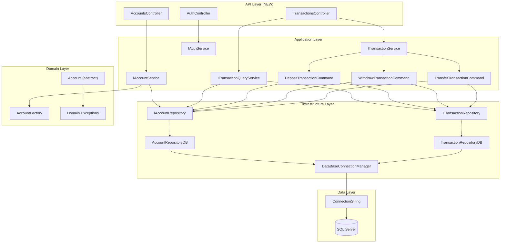
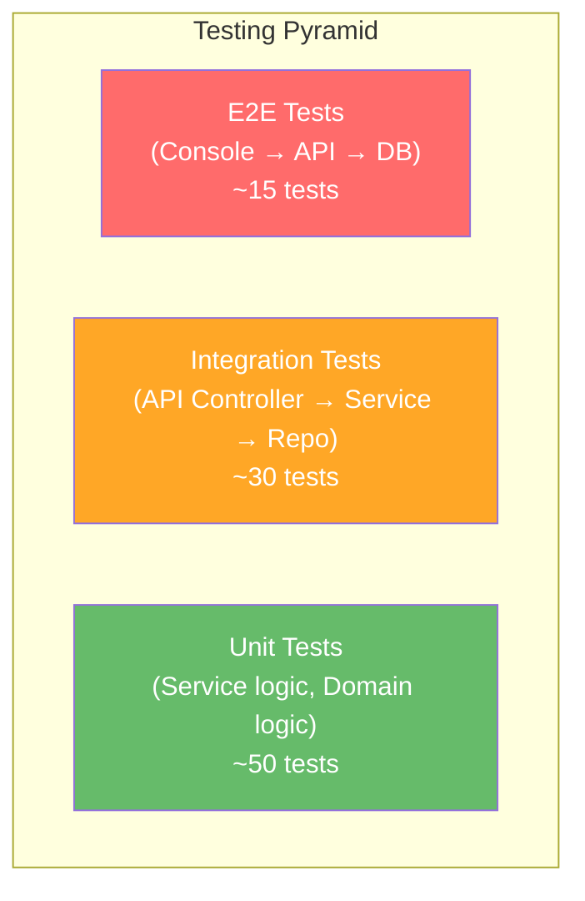

# GDB Migration Roadmap — Part 2

## Sections 10–17: Dependencies, Risk, Testing, Documentation, Configuration, PM, Quality, Appendices

---

# Section 10 — Dependency Analysis

## 10.1 Inter-Component Dependency Graph



## 10.2 DI Registration Order (R3)

| Registration Order | Interface | Implementation | Lifetime | Depends On |
|---|---|---|---|---|
| 1 | `IConfiguration` | Built-in | Singleton | — |
| 2 | `DataBaseConnectionManager` | Self | Scoped | IConfiguration (connection string) |
| 3 | `IAccountRepository` | `AccountRepositoryDB` | Scoped | DataBaseConnectionManager |
| 4 | `ITransactionRepository` | `TransactionRepositoryDB` | Scoped | DataBaseConnectionManager |
| 5 | `DepositTransactionCommand` | Self | Scoped | IAccountRepository, ITransactionRepository |
| 6 | `WithdrawTransactionCommand` | Self | Scoped | IAccountRepository, ITransactionRepository |
| 7 | `TransferTransactionCommand` | Self | Scoped | IAccountRepository, ITransactionRepository |
| 8 | `IAccountService` | `AccountService` | Scoped | IAccountRepository |
| 9 | `ITransactionService` | `TransactionService` | Scoped | DTC, WTC, TTC, IAccountRepository |
| 10 | `ITransactionQueryService` | `TransactionQueryService` | Scoped | ITransactionRepository, IAccountRepository |
| 11 | `IAuthService` | `AuthService` | Scoped | IConfiguration |

## 10.3 Factory → DI Migration Matrix

| Existing Factory | Creates | DI Replacement | Impact |
|---|---|---|---|
| [AccountRepositoryFactory](file:///c:/GDB/gdb/Infrastructure/Repositories/AccountRepositoryFactory.cs) | `IAccountRepository` (DB or InMemory) | `services.AddScoped<IAccountRepository, AccountRepositoryDB>()` | Removes config-based switching; InMemory only for unit tests |
| [TransactionRepositoryFactory](file:///c:/GDB/gdb/Infrastructure/Repositories/TransactionRepositoryFactory.cs) | `ITransactionRepository` | `services.AddScoped<ITransactionRepository, TransactionRepositoryDB>()` | Same as above |
| [AccountServiceFactory](file:///c:/GDB/gdb/Application/Services/AccountServiceFactory.cs) | `IAccountService` | `services.AddScoped<IAccountService, AccountService>()` | Constructor receives IAccountRepository via DI |
| [TransactionServiceFactory](file:///c:/GDB/gdb/Application/Services/TransactionServiceFactory.cs) | `ITransactionService` | `services.AddScoped<ITransactionService, TransactionService>()` | Constructor receives commands via DI |
| [TransactionQueryServiceFactory](file:///c:/GDB/gdb/Application/Services/TransactionQueryServiceFactory.cs) | `ITransactionQueryService` | `services.AddScoped<ITransactionQueryService, TransactionQueryService>()` | Constructor receives repos via DI |
| [TransactionCommandFactory](file:///c:/GDB/gdb/Application/Services/TransactionCommandFactory.cs) | `ITransactionCommand<T>` | Individual command registration | Each command registered separately |

## 10.4 Configuration Migration

| Setting | Current Source | Current Key | Target Source | Target Key |
|---|---|---|---|---|
| Connection string | `App.config` | `connectionStrings/GDBConnection` | `appsettings.json` | `ConnectionStrings:GDBConnection` |
| Provider | `App.config` | `system.data/DbProviderFactories` | `appsettings.json` | Not needed (Microsoft.Data.SqlClient auto-registers) |
| Logging | `appsettings.json` | `Logging:LogLevel` | `appsettings.json` (API) | `Logging:LogLevel` + Serilog config |
| JWT Secret | N/A | N/A | `appsettings.json` | `Jwt:Key`, `Jwt:Issuer`, `Jwt:Audience` |
| Docker port | N/A | N/A | `docker-compose.yml` | `ports: "8080:8080"` |
| API Base URL | N/A | N/A | `appsettings.json` (Console) | `ApiSettings:BaseUrl` |

## 10.5 NuGet Package Changes

### Packages Added to GDB.Api

| Package | Version | Purpose | Release |
|---|---|---|---|
| `Swashbuckle.AspNetCore` | Latest 8.x | Swagger/OpenAPI | R1 |
| `Serilog.AspNetCore` | Latest | Structured logging | R1 |
| `Asp.Versioning.Http` | Latest 8.x | API versioning | R5 |
| `Asp.Versioning.ApiExplorer` | Latest 8.x | Swagger versioning support | R5 |
| `Microsoft.AspNetCore.Authentication.JwtBearer` | 8.x | JWT authentication | R6 |
| `System.IdentityModel.Tokens.Jwt` | Latest | Token generation | R6 |

### Packages Added to GdbWebApi (for R8)

| Package | Version | Purpose | Release |
|---|---|---|---|
| `Microsoft.Extensions.Http` | 8.x | IHttpClientFactory | R8 |
| `System.Net.Http.Json` | 8.x | JSON serialization for HttpClient | R8 |

### Packages Removed from GdbWebApi

| Package | Reason | Release |
|---|---|---|
| `System.Data.SqlClient` | Redundant — `Microsoft.Data.SqlClient` is primary | R1 |
| `System.Configuration.ConfigurationManager` | Replaced by `IConfiguration` in ASP.NET Core | R3 |

---

# Section 11 — Risk Assessment

## 11.1 Risk Register

| ID | Risk | Probability | Impact | Severity | Mitigation | Owner | Release |
|---|---|---|---|---|---|---|---|
| RSK-1 | **DataBaseConnectionManager static coupling** — `GetConnection()` is static and reads from `ConfigurationManager`. Migrating to DI requires refactoring all callers. | High | High | 🔴 Critical | Refactor to accept `IConfiguration` injection or connection string parameter. Approach: wrap in a `DbConnectionFactory` that receives connection string via DI. | Dev A | R3 |
| RSK-2 | **Stored procedure dependency** — API assumes all stored procedures exist in DB. Missing SPs will cause runtime failures. | Medium | High | 🟠 High | Create validation script that checks for SP existence at startup. Document required SPs. | Dev A | R2 |
| RSK-3 | **Async-over-sync in AccountService** — `CreateAccount` uses `GetAwaiter().GetResult()` which can deadlock under ASP.NET Core's thread pool. | High | High | 🔴 Critical | Convert to proper `async Task` pattern. Must be done during R2 controller migration. | Dev B | R2 |
| RSK-4 | **Internal class visibility** — Multiple classes are `internal`, preventing cross-project DI registration. | High | Medium | 🟠 High | Change to `public` during R2. Low risk — only affects visibility, not behavior. | Dev A | R2 |
| RSK-5 | **DataBaseProviderRegistration dependency** — Uses `DbProviderFactories.RegisterFactory` via reflection. In .NET 8 with Microsoft.Data.SqlClient, this is auto-registered. | Medium | Low | 🟡 Medium | Test if removing `DataBaseProviderRegistration.Register()` breaks DB access. If yes, keep call in API startup. | Dev A | R1 |
| RSK-6 | **InMemory repository compatibility** — `AccountRepositoryInMemory` calls `AccountFactory.CreateAccount` which may create circular dependency when DI is introduced. | Low | Medium | 🟡 Medium | InMemory repos are for testing only. Ensure DI registration only uses DB repos in production. | Dev C | R3 |
| RSK-7 | **JWT secret in appsettings.json** — Hardcoded JWT secret in configuration file. | Medium | High | 🟠 High | Use environment variables or secrets manager for production. Document in R6. | Dev C | R6 |
| RSK-8 | **Docker SQL Server networking** — Container may not resolve host SQL Server hostname. | Medium | Medium | 🟡 Medium | Use `host.docker.internal` or host IP in connection string. Document networking requirements. | Dev C | R7 |
| RSK-9 | **Console HTTP client timeout** — Network latency could cause console app to hang. | Medium | Medium | 🟡 Medium | Configure HTTP timeouts. Add user-facing "connection lost" messages. | Dev C | R8 |
| RSK-10 | **Mixed sync/async repository methods** — `UpdateBalance`, `SaveAccount`, `SaveAccounts`, `CloseAccount` are synchronous. ASP.NET Core favors async. | Medium | Low | 🟡 Medium | Wrap synchronous calls in `Task.Run()` as short-term fix; refactor to async as follow-up. | Dev B | R2 |
| RSK-11 | **Missing PIN hashing** — PINs are stored as plaintext strings in the database. | Low (for migration) | High (for security) | 🟡 Medium | Out of scope for migration, but document as post-migration security enhancement. | Dev C | R6 |
| RSK-12 | **DataSet concurrency** — `GDBInMemoryDataStore.DataSet` is a static singleton. Multiple concurrent API requests could corrupt data. | High (under load) | Medium | 🟠 High | InMemory store is dev-only. Ensure DB mode is default for API. Add warning in documentation. | Dev A | R2 |

## 11.2 Risk Response Plan

| Severity | Response Strategy |
|---|---|
| 🔴 **Critical** (RSK-1, RSK-3) | Must be resolved before the release containing them. Block the sprint until fixed. |
| 🟠 **High** (RSK-2, RSK-4, RSK-7, RSK-12) | Schedule mitigation in the same sprint. Add explicit verification to acceptance criteria. |
| 🟡 **Medium** (RSK-5, RSK-6, RSK-8, RSK-9, RSK-10, RSK-11) | Document workaround. Schedule fix within the same release or next. |

## 11.3 Contingency Time Allocation

| Sprint | Planned Work | Buffer Hours | Buffer % | Primary Risk |
|---|---|---|---|---|
| Sprint 1 (R1) | 60h | 12h | 17% | RSK-5 (Provider registration) |
| Sprint 2–3 (R2) | 120h | 24h | 17% | RSK-3 (Async deadlock), RSK-4 (Access modifiers) |
| Sprint 4 (R3) | 56h | 16h | 22% | RSK-1 (Static connection manager) |
| Sprint 5 (R4) | 54h | 18h | 25% | Validation edge cases |
| Sprint 6 (R5) | 54h | 18h | 25% | Exception mapping accuracy |
| Sprint 7 (R6) | 54h | 18h | 25% | RSK-7 (JWT security) |
| Sprint 8 (R7) | 54h | 18h | 25% | RSK-8 (Docker networking) |
| Sprint 9–10 (R8) | 120h | 24h | 17% | RSK-9 (HTTP timeouts) |

---

# Section 12 — Testing Strategy

## 12.1 Testing Layers



## 12.2 Test Matrix per Release

### R1 Tests

| Test ID | Type | Description | Expected Result |
|---|---|---|---|
| T-R1-01 | Smoke | Solution builds without errors | Exit code 0 |
| T-R1-02 | Smoke | API starts on configured port | Process running |
| T-R1-03 | Integration | GET /api/health returns 200 | Status 200, body has timestamp |
| T-R1-04 | Smoke | Swagger UI loads | HTML rendered at /swagger |

### R2 Tests

| Test ID | Type | Description | Expected Result |
|---|---|---|---|
| T-R2-01 | Integration | POST /api/accounts — valid Savings account | 201 Created, account details returned |
| T-R2-02 | Integration | POST /api/accounts — valid Current account | 201 Created |
| T-R2-03 | Integration | POST /api/accounts — valid FixedDeposit account | 201 Created |
| T-R2-04 | Integration | POST /api/accounts — valid Salary account | 201 Created |
| T-R2-05 | Integration | GET /api/accounts/{existing} | 200 OK, correct data |
| T-R2-06 | Integration | GET /api/accounts/{nonexistent} | 404 Not Found |
| T-R2-07 | Integration | GET /api/accounts | 200 OK, list of accounts |
| T-R2-08 | Integration | GET /api/accounts/{id}/balance | 200 OK, balance value |
| T-R2-09 | Integration | DELETE /api/accounts/{existing} | 200 OK, status Closed |
| T-R2-10 | Integration | DELETE /api/accounts/{nonexistent} | 404 Not Found |
| T-R2-11 | Integration | POST /api/transactions/deposit — valid | 200 OK, updated balance |
| T-R2-12 | Integration | POST /api/transactions/withdraw — valid | 200 OK, updated balance |
| T-R2-13 | Integration | POST /api/transactions/withdraw — insufficient balance | Error response |
| T-R2-14 | Integration | POST /api/transactions/withdraw — invalid PIN | Error response |
| T-R2-15 | Integration | POST /api/transactions/transfer — valid | 200 OK, transfer details |
| T-R2-16 | Integration | POST /api/transactions/transfer — same account | Error response |
| T-R2-17 | Integration | GET /api/transactions/{id}/recent — with history | 200 OK, list of transactions |
| T-R2-18 | Integration | GET /api/transactions/{id}/recent — no history | 200 OK, empty list |
| T-R2-19 | Regression | Console app still works directly (pre-R8) | All 9 operations functional |

### R3 Tests

| Test ID | Type | Description | Expected Result |
|---|---|---|---|
| T-R3-01 | Smoke | App starts without DI resolution errors | No exceptions at startup |
| T-R3-02 | Integration | Re-run all T-R2 tests | Identical results |
| T-R3-03 | Unit | Verify no factory classes exist in codebase | `grep` finds zero factory files |
| T-R3-04 | Integration | Verify DB connections are disposed per-request | No connection leaks |

### R4 Tests

| Test ID | Type | Description | Expected Result |
|---|---|---|---|
| T-R4-01 | Integration | POST /api/accounts — missing AccountNumber | 400 with validation error |
| T-R4-02 | Integration | POST /api/accounts — invalid AccountNumber (not 10 digits) | 400 with validation error |
| T-R4-03 | Integration | POST /api/accounts — age < 18 | 400 with validation error |
| T-R4-04 | Integration | POST /api/accounts — negative balance | 400 with validation error |
| T-R4-05 | Integration | POST /api/accounts — missing PIN | 400 with validation error |
| T-R4-06 | Integration | POST /api/accounts — PIN not 4 digits | 400 with validation error |
| T-R4-07 | Integration | POST /api/transactions/deposit — zero amount | 400 with validation error |
| T-R4-08 | Integration | POST /api/transactions/deposit — negative amount | 400 with validation error |
| T-R4-09 | Integration | ApiResponse\<T\> wrapper has Success, Data, Errors | Consistent structure verified |
| T-R4-10 | Regression | Re-run all T-R2 tests with valid payloads | All pass |

### R5 Tests

| Test ID | Type | Description | Expected Result |
|---|---|---|---|
| T-R5-01 | Integration | Trigger AccountException → 400 with ProblemDetails | Correct status + format |
| T-R5-02 | Integration | Trigger InvalidPinException → 401 | Correct status |
| T-R5-03 | Integration | Trigger InsufficientBalanceException → 422 | Correct status |
| T-R5-04 | Integration | Trigger MinimumBalanceViolationException → 422 | Correct status |
| T-R5-05 | Integration | Trigger InactiveAccountException → 409 | Correct status |
| T-R5-06 | Integration | Trigger unhandled exception → 500 | Generic error, no stack trace in response |
| T-R5-07 | Integration | CORS preflight OPTIONS request | Correct CORS headers |
| T-R5-08 | Integration | GET /api/v1/accounts works | 200 OK |
| T-R5-09 | Integration | GET /api/accounts (no version) → default version | 200 OK or 400 (based on config) |

### R6 Tests

| Test ID | Type | Description | Expected Result |
|---|---|---|---|
| T-R6-01 | Integration | POST /api/auth/login — valid credentials | 200 OK, JWT token returned |
| T-R6-02 | Integration | POST /api/auth/login — invalid credentials | 401 Unauthorized |
| T-R6-03 | Integration | GET /api/accounts — no token | 401 Unauthorized |
| T-R6-04 | Integration | GET /api/accounts — valid User token | 200 OK (own account) |
| T-R6-05 | Integration | GET /api/accounts — Teller token | 200 OK (all accounts) |
| T-R6-06 | Integration | POST /api/accounts — User token | 403 Forbidden |
| T-R6-07 | Integration | POST /api/accounts — Teller token | 201 Created |
| T-R6-08 | Integration | DELETE /api/accounts/{id} — Teller token | 403 Forbidden |
| T-R6-09 | Integration | DELETE /api/accounts/{id} — Manager token | 200 OK |
| T-R6-10 | Integration | GET /api/health — no token | 200 OK (AllowAnonymous) |
| T-R6-11 | Security | JWT with expired token | 401 Unauthorized |
| T-R6-12 | Security | JWT with tampered payload | 401 Unauthorized |

### R7 Tests

| Test ID | Type | Description | Expected Result |
|---|---|---|---|
| T-R7-01 | Smoke | `docker build` completes | Exit code 0 |
| T-R7-02 | Smoke | `docker run` starts container | Container running |
| T-R7-03 | Integration | GET /api/health from host | 200 OK |
| T-R7-04 | Integration | Full API test suite from host against container | All pass |
| T-R7-05 | Integration | DB operations from container | Data persisted |
| T-R7-06 | Resilience | Container restart — API recovers | API responds after restart |
| T-R7-07 | Smoke | Health check endpoint used by Docker | Container marked healthy |

### R8 Tests

| Test ID | Type | Description | Expected Result |
|---|---|---|---|
| T-R8-01 | E2E | Console login → JWT stored | Token acquired |
| T-R8-02 | E2E | Console Create Account → API → DB | Account created, confirmed via API |
| T-R8-03 | E2E | Console View Account → API → DB | Account details displayed |
| T-R8-04 | E2E | Console View All Accounts → API → DB | All accounts displayed |
| T-R8-05 | E2E | Console View Balance → API → DB | Balance displayed |
| T-R8-06 | E2E | Console Deposit → API → DB | Balance increased |
| T-R8-07 | E2E | Console Withdraw → API → DB | Balance decreased |
| T-R8-08 | E2E | Console Transfer → API → DB | Both balances updated |
| T-R8-09 | E2E | Console View Transactions → API → DB | Transaction history displayed |
| T-R8-10 | E2E | Console Close Account → API → DB | Account status Closed |
| T-R8-11 | E2E | Console → API down → user-friendly error | Error message displayed, no crash |
| T-R8-12 | E2E | Console → API timeout → retry message | Timeout handled gracefully |
| T-R8-13 | E2E | Console → invalid credentials → error | Login failed message |

## 12.3 Manual Testing Checklist (per release)

| # | Verification | Pass Criteria |
|---|---|---|
| 1 | Solution builds with `dotnet build` | Exit code 0, no warnings |
| 2 | API starts with `dotnet run` | Console shows listening URL |
| 3 | Swagger UI accessible | Page loads, endpoints listed |
| 4 | Each endpoint testable via Swagger | Correct request/response |
| 5 | Error responses include ProblemDetails (R5+) | JSON with type, title, status, detail |
| 6 | Authentication required for protected endpoints (R6+) | 401 without token |
| 7 | Docker container runs (R7+) | `docker ps` shows running |
| 8 | Console app works via API (R8) | All operations functional |

---

# Section 13 — Documentation Plan

## 13.1 Documentation Deliverables

| Document | Owner | Release | Purpose |
|---|---|---|---|
| `README.md` | Dev A | R1, updated each release | Project overview, setup instructions |
| `API-ENDPOINTS.md` | Dev B | R2 | Complete endpoint reference |
| `ARCHITECTURE.md` | Dev A | R2 | Architecture overview, design decisions |
| `DI-CONFIGURATION.md` | Dev A | R3 | DI registration documentation |
| `VALIDATION-RULES.md` | Dev B | R4 | Request validation specifications |
| `ERROR-CODES.md` | Dev C | R5 | Exception-to-HTTP status mapping |
| `AUTH-GUIDE.md` | Dev C | R6 | Authentication flow, role permissions |
| `DOCKER-GUIDE.md` | Dev C | R7 | Build, run, deploy instructions |
| `CONSOLE-CLIENT-GUIDE.md` | Dev C | R8 | Console app setup and usage |
| `CHANGELOG.md` | Dev A | Every release | Release notes and changes |
| `MIGRATION-DECISIONS.md` | Dev A | Ongoing | ADR log for migration choices |

## 13.2 API Documentation Standard

Each endpoint documentation must include:
- HTTP method and URL
- Request headers (Content-Type, Authorization)
- Request body schema with examples
- Response status codes
- Response body schema with examples
- Error response examples
- Role requirements

### Example: POST /api/v1/accounts

```json
// Request
POST /api/v1/accounts
Content-Type: application/json
Authorization: Bearer {token}

{
    "accountNumber": "1000001015",
    "name": "Rohit Gupta",
    "age": 28,
    "balance": 50000.00,
    "pin": "1234",
    "accountType": "Savings",
    "status": "Active",
    "privilege": "Gold",
    "minimumBalance": 1000.00,
    "interestRate": 4.0
}

// Response 201
{
    "success": true,
    "data": {
        "accountNumber": "1000001015",
        "name": "Rohit Gupta",
        "accountType": "Savings",
        "balance": 50000.00,
        "status": "Active",
        "privilege": "Gold"
    },
    "errors": null
}

// Response 400
{
    "type": "https://tools.ietf.org/html/rfc7231#section-6.5.1",
    "title": "Bad Request",
    "status": 400,
    "detail": "One or more validation errors occurred.",
    "errors": {
        "AccountNumber": ["Account number must be exactly 10 digits."],
        "Pin": ["PIN is required."]
    }
}
```

---

# Section 14 — Configuration Strategy

## 14.1 appsettings.json Structure (GDB.Api)

```json
{
    "ConnectionStrings": {
        "GDBConnection": "Server=.;Database=GDB;Trusted_Connection=True;TrustServerCertificate=True;"
    },
    "Jwt": {
        "Key": "YourSuperSecretKeyHere_MustBe256BitsOrMore",
        "Issuer": "GDB.Api",
        "Audience": "GDB.Clients",
        "ExpirationMinutes": 60
    },
    "Logging": {
        "LogLevel": {
            "Default": "Information",
            "Microsoft.AspNetCore": "Warning",
            "GDB": "Debug"
        }
    },
    "Serilog": {
        "MinimumLevel": "Information",
        "WriteTo": [
            { "Name": "Console" },
            {
                "Name": "File",
                "Args": { "path": "logs/gdb-api-.log", "rollingInterval": "Day" }
            }
        ]
    },
    "AllowedHosts": "*",
    "ApiVersioning": {
        "DefaultVersion": "1.0",
        "AssumeDefaultVersionWhenUnspecified": true
    }
}
```

## 14.2 appsettings.Development.json

```json
{
    "ConnectionStrings": {
        "GDBConnection": "Server=localhost;Database=GDB_Dev;Trusted_Connection=True;TrustServerCertificate=True;"
    },
    "Jwt": {
        "Key": "DevOnlyKey_DoNotUseInProduction_MustBe256Bits!!",
        "ExpirationMinutes": 480
    },
    "Logging": {
        "LogLevel": {
            "Default": "Debug",
            "Microsoft.AspNetCore": "Information"
        }
    }
}
```

## 14.3 Docker Environment Variables

```dockerfile
ENV ASPNETCORE_ENVIRONMENT=Production
ENV ASPNETCORE_URLS=http://+:8080
ENV ConnectionStrings__GDBConnection="Server=host.docker.internal;Database=GDB;User Id=gdb_api;Password=CHANGEME;TrustServerCertificate=True;"
ENV Jwt__Key="ProductionSecretKey_SetViaEnvironment"
```

## 14.4 Console App Configuration (R8)

```json
{
    "ApiSettings": {
        "BaseUrl": "http://localhost:5000",
        "TimeoutSeconds": 30,
        "RetryCount": 3
    }
}
```

---

# Section 15 — Project Management

## 15.1 Sprint Ceremony Schedule

| Ceremony | Duration | Timing | Attendees |
|---|---|---|---|
| Sprint Planning | 1 hour | Day 1, first hour | All developers |
| Daily Standup | 15 minutes | Every day, start of day | All developers |
| Sprint Review/Demo | 1 hour | Day 4, end of day | All developers + stakeholders |
| Sprint Retrospective | 30 minutes | Day 4, after review | All developers |

## 15.2 Definition of Done (per task)

A task is **Done** when:
1. ✅ Code is written and compiles without errors or warnings
2. ✅ Code passes all existing tests
3. ✅ New tests written for new functionality
4. ✅ Code reviewed by at least 1 other developer
5. ✅ Acceptance criteria verified manually
6. ✅ Documentation updated if applicable
7. ✅ Committed to `develop` branch via PR
8. ✅ No known regressions

## 15.3 Definition of Done (per release)

A release is **Done** when:
1. ✅ All tasks in the release are Done
2. ✅ Full regression test suite passes
3. ✅ Release-specific acceptance criteria verified
4. ✅ API documentation updated
5. ✅ CHANGELOG.md updated
6. ✅ `develop` merged to `release/rN`
7. ✅ Release tagged in Git
8. ✅ Stakeholder demo completed

## 15.4 Communication Plan

| Channel | Purpose | Frequency |
|---|---|---|
| Git PRs | Code review, technical discussion | Every task |
| Daily Standup | Blockers, progress, coordination | Daily |
| Sprint Board | Task tracking, burndown | Continuous |
| Team Chat | Quick questions, help requests | As needed |
| Sprint Review | Demo, stakeholder alignment | Per sprint |

## 15.5 Burndown Tracking

Each sprint should track:
- **Planned hours**: Tasks committed to sprint
- **Completed hours**: Tasks marked Done
- **Remaining hours**: In-progress + not started
- **Blocked hours**: Tasks waiting on dependencies
- **Burndown chart**: Updated daily

---

# Section 16 — Quality Gates

## 16.1 Gate Definitions

| Gate | Timing | Criteria | Blocker? |
|---|---|---|---|
| **G1: Build Gate** | Every commit | `dotnet build` succeeds | Yes |
| **G2: Test Gate** | Every PR | All existing tests pass | Yes |
| **G3: Code Review Gate** | Every PR | At least 1 approval | Yes |
| **G4: Integration Gate** | End of sprint | All endpoints verified via Swagger | Yes |
| **G5: Regression Gate** | Before release | All previous release tests re-pass | Yes |
| **G6: Security Gate** | R6+ | Auth endpoints verified, 401/403 tests pass | Yes |
| **G7: Container Gate** | R7+ | Docker image builds and runs | Yes |
| **G8: E2E Gate** | R8 | Console → API → DB verified | Yes |

## 16.2 Release Verification Checklist

### R1 Release Verification
```
[ ] dotnet build GDB.sln — exit code 0
[ ] dotnet run --project GDB.Api — starts on port
[ ] GET /api/health — 200 OK
[ ] Swagger UI loads — endpoints visible
[ ] Git branch structure — develop, main
[ ] appsettings.json — connection string present
```

### R2 Release Verification
```
[ ] All 9 endpoints return correct data
[ ] POST /api/accounts — creates in DB
[ ] GET /api/accounts — returns all from DB
[ ] POST /api/transactions/deposit — balance increases
[ ] POST /api/transactions/withdraw — balance decreases, PIN validated
[ ] POST /api/transactions/transfer — both accounts updated
[ ] DELETE /api/accounts/{id} — status changes to Closed
[ ] GET /api/transactions/{id}/recent — returns history
[ ] Console app still works (backward compatibility)
```

### R3 Release Verification
```
[ ] Zero factory classes in codebase (grep verification)
[ ] ServiceRegistration.cs contains all registrations
[ ] App starts without DI errors
[ ] All R2 tests re-pass
[ ] DB connections disposed per-request (no connection pool exhaustion)
```

### R4 Release Verification
```
[ ] Invalid AccountNumber → 400 with clear error
[ ] Missing required fields → 400 with field-level errors
[ ] Out-of-range Age → 400
[ ] Valid requests → unchanged behavior
[ ] ApiResponse<T> wrapper on all responses
```

### R5 Release Verification
```
[ ] AccountException → 400 Bad Request ProblemDetails
[ ] InvalidPinException → 401 Unauthorized ProblemDetails
[ ] InsufficientBalanceException → 422 ProblemDetails
[ ] Unhandled exception → 500 (no stack trace in response)
[ ] CORS headers present on responses
[ ] /api/v1/ routes functional
```

### R6 Release Verification
```
[ ] POST /api/auth/login — returns JWT
[ ] Protected endpoint without token → 401
[ ] User accessing admin endpoint → 403
[ ] Admin accessing all endpoints → 200
[ ] Expired token → 401
[ ] Swagger JWT "Authorize" button works
```

### R7 Release Verification
```
[ ] docker build -t gdb-api . — succeeds
[ ] docker run gdb-api — container starts
[ ] curl http://localhost:8080/api/health — 200
[ ] Full API test suite passes against container
[ ] DB operations work from container
```

### R8 Release Verification
```
[ ] Console login prompt appears
[ ] Login → token stored in memory
[ ] All 9 operations work via Console → HTTP → API → DB
[ ] API down → "Service unavailable" message (no crash)
[ ] Invalid credentials → "Login failed" message
[ ] All error scenarios display user-friendly messages
```

---

# Section 17 — Appendices

## Appendix A — Existing API Endpoint Design

| HTTP Method | Route | Console Equivalent | Request Body | Response | Status Codes |
|---|---|---|---|---|---|
| `GET` | `/api/v1/accounts/{accountNumber}` | Option 2: View Account | — | `ViewAccountResponseDto` | 200, 404 |
| `GET` | `/api/v1/accounts` | Option 3: View All Accounts | — | `List<ViewAllAccountsResponseDto>` | 200 |
| `GET` | `/api/v1/accounts/{accountNumber}/balance` | Option 4: View Balance | — | `ViewBalanceResponseDto` | 200, 404 |
| `POST` | `/api/v1/accounts` | Option 1: Create Account | `CreateAccountRequestDto` | `CreateAccountResponseDto` | 201, 400 |
| `DELETE` | `/api/v1/accounts/{accountNumber}` | Option 9: Close Account | — | `CloseAccountResponseDto` | 200, 404 |
| `POST` | `/api/v1/transactions/deposit` | Option 7: Deposit | `DepositRequestDto` | `DepositResponseDto` | 200, 400, 404 |
| `POST` | `/api/v1/transactions/withdraw` | Option 6: Withdraw | `WithdrawRequestDto` | `WithdrawResponseDto` | 200, 400, 401, 404, 422 |
| `POST` | `/api/v1/transactions/transfer` | Option 8: Transfer Funds | `TransferRequestDto` | `TranferFundsResponseDto` | 200, 400, 401, 404, 422 |
| `GET` | `/api/v1/transactions/{accountNumber}/recent` | Option 5: View Recent Transactions | — | `List<ViewRecentTransactionsResponseDto>` | 200, 404 |
| `POST` | `/api/v1/auth/login` | N/A (new) | `LoginRequestDto` | `LoginResponseDto` | 200, 401 |
| `GET` | `/api/health` | N/A (new) | — | Health status | 200 |

## Appendix B — Database Schema Reference

### Tables and Relationships

```mermaid
erDiagram
    Accounts ||--o{ SavingsAccounts : "has"
    Accounts ||--o{ CurrentAccounts : "has"
    Accounts ||--o{ FixedDepositAccounts : "has"
    Accounts ||--o{ SalaryAccounts : "has"
    Accounts ||--o{ Transactions : "from"
    Accounts ||--o{ Transactions : "to"
    
    AccountTypes ||--o{ Accounts : "classifies"
    AccountStatuses ||--o{ Accounts : "status"
    AccountPrivileges ||--o{ Accounts : "privilege"
    TransactionTypes ||--o{ Transactions : "classifies"
    TransactionStatuses ||--o{ Transactions : "status"
    
    Accounts {
        bigint AccountId PK
        varchar AccountNumber UK
        varchar Name
        int Age
        decimal Balance
        int AccountTypeId FK
        int AccountStatusId FK
        int AccountPrivilegeId FK
        varchar Pin
        datetime ClosedAt
    }
    
    SavingsAccounts {
        bigint AccountId PK_FK
        decimal InterestRate
        decimal MinimumBalance
    }
    
    CurrentAccounts {
        bigint AccountId PK_FK
        decimal OverdraftLimit
    }
    
    FixedDepositAccounts {
        bigint AccountId PK_FK
        decimal InterestRate
        int TenureMonths
        decimal PrincipalAmount
        datetime MaturityDate
        decimal MaturityAmount
    }
    
    SalaryAccounts {
        bigint AccountId PK_FK
        varchar EmployerName
        int InactiveMonths
        decimal SalaryAmount
    }
    
    Transactions {
        bigint TransactionId PK
        int TransactionTypeId FK
        bigint FromAccountId FK
        bigint ToAccountId FK
        decimal Amount
        int TransactionStatusId FK
        datetime Timestamp
        decimal BalanceAfterFrom
        decimal BalanceAfterTo
    }
```

### Stored Procedures Referenced

| Stored Procedure | Called By | Parameters |
|---|---|---|
| `GetAccount` | `AccountRepositoryDB.GetAccountAsync` | `@AccountNumber` |
| `CreateAccount` | `AccountRepositoryDB.SaveAccount` | `@AccountNumber, @Name, @Age, @AccountType, @Balance, @AccountStatus, @AccountPrivilege, @Pin` |
| `InsertSavingsAccount` | `AccountRepositoryDB.SaveSavingsAccount` | `@AccountId, @InterestRate, @MinimumBalance` |
| `InsertCurrentAccount` | `AccountRepositoryDB.SaveCurrentAccount` | `@AccountId, @OverdraftLimit` |
| `InsertFixedDepositAccount` | `AccountRepositoryDB.SaveFixedDepositAccount` | `@AccountId, @InterestRate, @TenureMonths, @PrincipalAmount, @MaturityAmount` |
| `InsertSalaryAccount` | `AccountRepositoryDB.SaveSalaryAccount` | `@AccountId, @EmployerName, @InactiveMonths, @SalaryAmount` |

## Appendix C — Glossary

| Term | Definition |
|---|---|
| **ADO.NET** | .NET data access framework used for raw SQL/stored procedure execution |
| **ADR** | Architectural Decision Record |
| **Clean Architecture** | Software architecture pattern with concentric dependency layers |
| **CORS** | Cross-Origin Resource Sharing — browser security mechanism |
| **DI** | Dependency Injection — design pattern for resolving dependencies |
| **DTO** | Data Transfer Object — plain object for API request/response |
| **E2E** | End-to-End — testing from client through API to database |
| **JWT** | JSON Web Token — stateless authentication token |
| **ProblemDetails** | RFC 7807 standardized error response format |
| **Scoped** | DI lifetime — one instance per HTTP request |
| **Singleton** | DI lifetime — one instance for the application lifetime |
| **SP** | Stored Procedure — precompiled SQL in the database |
| **Swagger** | OpenAPI documentation/testing UI |

## Appendix D — Sprint Velocity Assumptions

| Metric | Value | Rationale |
|---|---|---|
| Sprint Duration | 4 working days | As specified |
| Hours/Dev/Day | 6 productive hours | After meetings, context switching |
| Team Capacity/Sprint | 72 person-hours | 3 devs × 24 hrs |
| Planning Overhead | ~10% per sprint | Standups, reviews, retrospective |
| Bug Fix Buffer | ~15% per sprint | Unforeseen issues |
| Net Productive Hours | ~54 hours/sprint | After overhead and buffer |
| Story Point Equivalent | 1 point ≈ 4 hours | For relative estimation |

## Appendix E — File-by-File Migration Checklist

| File | Layer | LOC | Migration Action | Target Release | Risk |
|---|---|---|---|---|---|
| [TestAbstractAccount.cs](file:///c:/GDB/gdb/Presentation/UI/TestAbstractAccount.cs) | Presentation | 88 | Reorganize entry point | R1 | Low |
| [Home.cs](file:///c:/GDB/gdb/Presentation/UI/Home.cs) | Presentation | 621 | Refactor to HTTP client | R8 | Medium |
| [DBTesting.cs](file:///c:/GDB/gdb/Presentation/UI/DBTesting.cs) | Presentation | 62 | Remove (dead code) | R1 | None |
| [AccountController.cs](file:///c:/GDB/gdb/Application/Controllers/AccountController.cs) | Application | 75 | Replace with API controller | R2 | Low |
| [TransactionController.cs](file:///c:/GDB/gdb/Application/Controllers/TransactionController.cs) | Application | 84 | Replace with API controller | R2 | Low |
| [AccountService.cs](file:///c:/GDB/gdb/Application/Services/Implementations/AccountService.cs) | Application | 399 | Add DI constructor, fix access modifier, fix async | R2–R3 | High |
| [TransactionService.cs](file:///c:/GDB/gdb/Application/Services/Implementations/TransactionService.cs) | Application | ~80 | Add DI constructor | R3 | Medium |
| [TransactionQueryService.cs](file:///c:/GDB/gdb/Application/Services/Implementations/TransactionQueryService.cs) | Application | ~50 | Add DI constructor | R3 | Medium |
| [DepositTransactionCommand.cs](file:///c:/GDB/gdb/Application/Services/Implementations/DepositTransactionCommand.cs) | Application | ~60 | Add DI constructor | R3 | Low |
| [WithdrawTransactionCommand.cs](file:///c:/GDB/gdb/Application/Services/Implementations/WithdrawTransactionCommand.cs) | Application | ~80 | Add DI constructor | R3 | Medium |
| [TransferTransactionCommand.cs](file:///c:/GDB/gdb/Application/Services/Implementations/TransferTransactionCommand.cs) | Application | ~90 | Add DI constructor | R3 | Medium |
| [AccountServiceFactory.cs](file:///c:/GDB/gdb/Application/Services/AccountServiceFactory.cs) | Application | ~20 | **DELETE** | R3 | None |
| [TransactionServiceFactory.cs](file:///c:/GDB/gdb/Application/Services/TransactionServiceFactory.cs) | Application | ~20 | **DELETE** | R3 | None |
| [TransactionQueryServiceFactory.cs](file:///c:/GDB/gdb/Application/Services/TransactionQueryServiceFactory.cs) | Application | ~20 | **DELETE** | R3 | None |
| [TransactionCommandFactory.cs](file:///c:/GDB/gdb/Application/Services/TransactionCommandFactory.cs) | Application | ~25 | **DELETE** | R3 | None |
| [CreateAccountRequestDto.cs](file:///c:/GDB/gdb/Application/Dtos/CreateAccountRequestDto.cs) | Application | 29 | Add validation attributes | R4 | Low |
| [CloseAccountRequestDto.cs](file:///c:/GDB/gdb/Application/Dtos/CloseAccountRequestDto.cs) | Application | 14 | Add validation | R4 | Low |
| [All other DTOs](file:///c:/GDB/gdb/Application/Dtos) | Application | ~150 | Reuse, minor updates | R4 | Low |
| [IAccount.cs](file:///c:/GDB/gdb/Domain/Models/IAccount.cs) | Domain | ~20 | **No change** | — | None |
| [Account.cs](file:///c:/GDB/gdb/Domain/Models/Account.cs) | Domain | ~200 | **No change** | — | None |
| [SavingsAccount.cs](file:///c:/GDB/gdb/Domain/Models/SavingsAccount.cs) | Domain | ~60 | **No change** | — | None |
| [CurrentAccount.cs](file:///c:/GDB/gdb/Domain/Models/CurrentAccount.cs) | Domain | ~50 | **No change** | — | None |
| [FixedDepositAccount.cs](file:///c:/GDB/gdb/Domain/Models/FixedDepositAccount.cs) | Domain | ~60 | **No change** | — | None |
| [SalaryAccount.cs](file:///c:/GDB/gdb/Domain/Models/SalaryAccount.cs) | Domain | ~50 | **No change** | — | None |
| [AccountFactory.cs](file:///c:/GDB/gdb/Domain/AccountFactory.cs) | Domain | ~30 | **Preserve** (domain logic) | — | None |
| [All Enums](file:///c:/GDB/gdb/Domain/Enums) | Domain | ~30 | **No change** | — | None |
| [All Exceptions](file:///c:/GDB/gdb/Domain/Exceptions) | Domain | ~60 | **No change** (mapped in R5) | R5 | None |
| [AccountRepositoryDB.cs](file:///c:/GDB/gdb/Infrastructure/Repositories/Implementations/AccountRepositoryDB.cs) | Infrastructure | 872 | Change access modifier, modify connection management | R2–R3 | High |
| [TransactionRepositoryDB.cs](file:///c:/GDB/gdb/Infrastructure/Repositories/Implementations/TransactionRepositoryDB.cs) | Infrastructure | 184 | Change access modifier, modify connection management | R2–R3 | Medium |
| [AccountRepositoryInMemory.cs](file:///c:/GDB/gdb/Infrastructure/Repositories/Implementations/AccountRepositoryInMemory.cs) | Infrastructure | 262 | **No change** (testing only) | — | None |
| [TransactionRepositoryInMemory.cs](file:///c:/GDB/gdb/Infrastructure/Repositories/Implementations/TransactionRepositoryInMemory.cs) | Infrastructure | 191 | **No change** (testing only) | — | None |
| [DataBaseConnectionManager.cs](file:///c:/GDB/gdb/Infrastructure/Repositories/DataBaseConnectionManager.cs) | Infrastructure | ~50 | **Refactor** for DI configuration | R3 | 🔴 High |
| [DataBaseProviderRegistration.cs](file:///c:/GDB/gdb/Infrastructure/Repositories/DataBaseProviderRegistration.cs) | Infrastructure | ~20 | Evaluate and potentially remove | R1 | Medium |
| [AccountRepositoryFactory.cs](file:///c:/GDB/gdb/Infrastructure/Repositories/AccountRepositoryFactory.cs) | Infrastructure | ~30 | **DELETE** | R3 | None |
| [TransactionRepositoryFactory.cs](file:///c:/GDB/gdb/Infrastructure/Repositories/TransactionRepositoryFactory.cs) | Infrastructure | ~20 | **DELETE** | R3 | None |
| [AccountQueries.cs](file:///c:/GDB/gdb/Infrastructure/Repositories/Queries/AccountQueries.cs) | Infrastructure | 248 | **No change** | — | None |
| [TransactionQueries.cs](file:///c:/GDB/gdb/Infrastructure/Repositories/Queries/TransactionQueries.cs) | Infrastructure | 114 | **No change** | — | None |
| [GDBInMemoryDB.cs](file:///c:/GDB/gdb/Data/GDBInMemoryDB.cs) | Data | 671 | **No change** | — | None |
| [AppLogger.cs](file:///c:/GDB/gdb/Logging/AppLogger.cs) | Logging | 24 | Evaluate: replace with DI ILogger or keep | R1 | Low |
| [App.config](file:///c:/GDB/gdb/App.config) | Config | ~20 | Migrate to appsettings.json | R1 | Medium |

## Appendix F — Effort Summary

| Release | Sprints | Calendar Days | Team Hours | Engineering Tasks | New Files | Modified Files | Deleted Files |
|---|---|---|---|---|---|---|---|
| R1 | 1 | 4 | 72 | 27 | 6 | 3 | 0 |
| R2 | 2 | 8 | 144 | 33 | 2 | 8 | 0 |
| R3 | 1 | 4 | 72 | 18 | 1 | 8 | 6 |
| R4 | 1 | 4 | 72 | 13 | 4 | 8 | 0 |
| R5 | 1 | 4 | 72 | 17 | 1 | 5 | 0 |
| R6 | 1 | 4 | 72 | 17 | 4 | 6 | 0 |
| R7 | 1 | 4 | 72 | 14 | 3 | 1 | 0 |
| R8 | 2 | 8 | 144 | 28 | 3 | 4 | 0 |
| **Total** | **10** | **40 days** | **720 hrs** | **167** | **24** | **43** | **6** |

---

> [!TIP]
> **How to use this roadmap**: Start with Sprint 1 (R1) and proceed sequentially. Each sprint's Day 1 column shows what to start building immediately. The Task IDs (e.g., T1.2.1.1) cross-reference between the WBS (Section 5), the Task Register (Section 6), and the Sprint Plan (Section 7) for full traceability.

---

*Document Version: 1.0*  
*Generated: 2026-10-01*  
*Source Codebase: GdbWebApi (c:\GDB\gdb)*  
*Target: ASP.NET Core 8 Web API*
