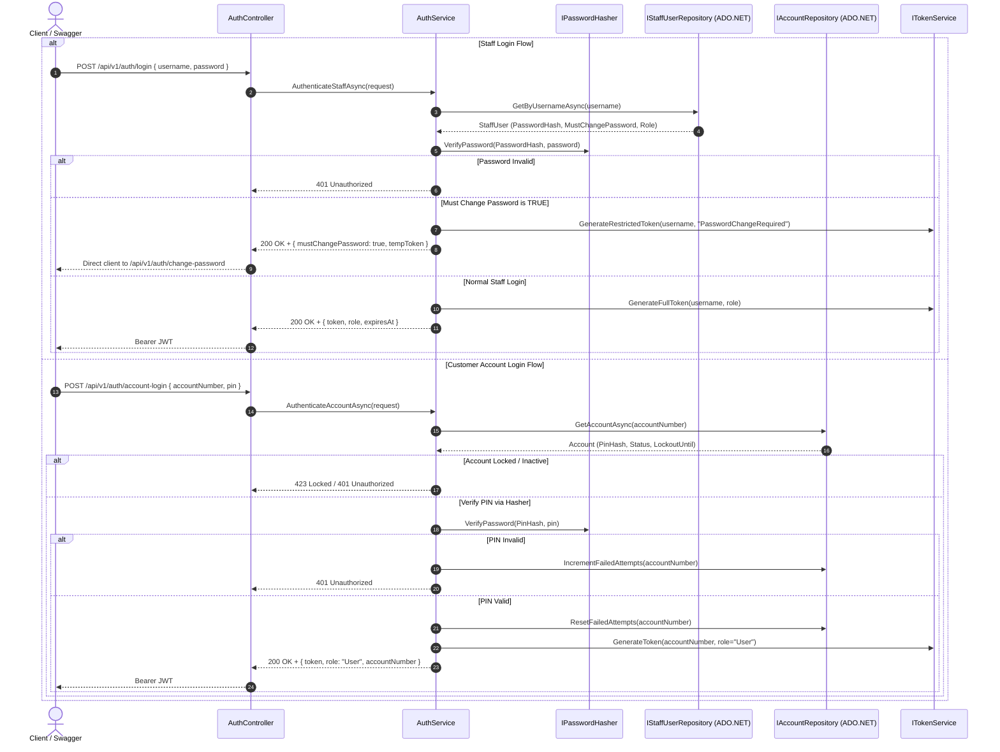
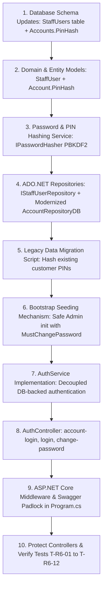

# Enterprise Authentication & Credential Architecture Plan (R6)

**Project:** Global Digital Bank (GDB) ASP.NET Core Web API  
**Status:** Audit & Proposal Phase (Pre-Implementation)  
**Constraints Enforced:**
- 🚫 Zero hardcoded passwords or PINs in C# code
- 🚫 Zero passwords or PINs in `appsettings.json`
- 🚫 Zero `ConcurrentDictionary` / in-memory collections as permanent identity stores
- 🚫 No Cloud Secret Managers (Key Vault / AWS Secrets / GitHub Secrets)
- 🚫 No Entity Framework Core or Dapper (100% native ADO.NET and existing repository pattern)
- 🔒 Database is the single source of truth for credentials and identities

---

## A. Current-State Audit Report

A thorough inspection of the repository (`GdbWebApi`) reveals the following current state across all authentication, identity, and credential components:

### 1. Authentication Endpoints & Controllers
- **Status:** There is currently **no `AuthController`** registered or active in `Application/Controllers/`. The only controllers present are `AccountController.cs`, `HomeController.cs`, and `TransactionController.cs`.
- **Existing Draft Files:** A drafted `AuthController.cs` was outlined in documentation, but no functional endpoint is hooked up or exposed in the Web API pipeline.

### 2. Services & Business Logic
- `IAuthService.cs` exists in `Application/Services/Contracts/`.
- `AuthService.cs` exists in `Application/Services/Implementations/`.
  - **Critical Finding (Staff Identity):** Lines 15–21 contain a hardcoded static dictionary:
    ```csharp
    private static readonly Dictionary<string, (string Password, string Role, string Name)> StaffStore =
        new(StringComparer.OrdinalIgnoreCase)
        {
            ["admin"] = ("Admin@123", UserRoles.Admin, "System Administrator"),
            ["manager"] = ("Manager@123", UserRoles.Manager, "Branch Manager"),
            ["teller"] = ("Teller@123", UserRoles.Teller, "Front Desk Teller")
        };
    ```
  - **Critical Finding (Staff Verification):** Authenticates via raw string equality (`staffInfo.Password == request.Password`). **Zero password hashing.**
  - **Customer PIN Verification:** Delegates to `account.ValidatePin(request.Pin)`.

### 3. Customer PIN Storage & Domain Validation
- **Domain Model (`Domain/Models/Account.cs`):**
  - Stores PIN as a plaintext string field `protected string _pin;`.
  - Validates PIN via plaintext string comparison:
    ```csharp
    public bool ValidatePin(string enteredPin)
    {
        return _pin == enteredPin;
    }
    ```
- **Database Repository (`Infrastructure/Repositories/Implementations/AccountRepositoryDB.cs`):**
  - Reads plaintext PIN directly from the SQL reader:
    ```csharp
    string pin = reader["Pin"].ToString();
    ```
  - Saves plaintext PIN to SQL Server via `CreateAccount` stored procedure:
    `@Pin` parameter passed as raw string.
- **In-Memory Store (`Data/GDBInMemoryDB.cs`):**
  - Table `ACCOUNT` defines `DataColumn("Pin", typeof(string)) { MaxLength = 4 }`.
  - Seeds 5 accounts with plaintext PINs: `"1234"`, `"2345"`, `"3456"`, `"4567"`, `"5678"`.

### 4. JWT & Token Infrastructure
- `JwtTokenService.cs` exists in `Application/Services/Implementations/`.
- Signs tokens using symmetric HMAC-SHA256 (`SymmetricSecurityKey`).
- **Configuration Exposure:** `appsettings.json` contains a committed key:
  ```json
  "Jwt": {
    "Key": "GDB_Super_Secret_Key_For_Jwt_Authentication_2026_Must_Be_At_Least_32_Bytes_Long!",
    "Issuer": "GdbWebApi",
    "Audience": "GdbBankingClients",
    "ExpiryMinutes": 60
  }
  ```
- `appsettings.Development.json` has **no** JWT configuration.
- **Pipeline Middleware (`Program.cs`):**
  - `app.UseAuthorization()` is called, but **`app.UseAuthentication()` is missing entirely**.
  - `builder.Services.AddAuthentication()` and `AddJwtBearer()` are not yet configured in `Program.cs`.

### 5. Authorization & Protected Endpoints
- **Controllers:** `AccountController.cs` and `TransactionController.cs` have **no `[Authorize]` attributes**.
- All balance queries, fund transfers, account creations, and closures are currently 100% public and unauthenticated.

---

## B. Database Verification

```text
Current staff credential storage:
NONE. No StaffUsers or Employees table exists in SQL Server or GDBInMemoryDB.
Staff credentials currently exist only as a hardcoded in-memory Dictionary in AuthService.cs.

Current customer PIN storage:
Stored as plaintext VARCHAR in the Accounts table (column: Pin) in SQL Server,
and as a 4-character string column 'Pin' in the in-memory ACCOUNT table.

Current user/account relationship:
1 Account = 1 Customer identity. There is NO separate Customers table.
The Accounts table directly stores 'Name', 'Age', 'Balance', 'Pin', and account type/status.

Current seed data:
- Customer Accounts: 5 seeded in GDBInMemoryDB (PINs: "1234", "2345", "3456", "4567", "5678").
- Staff Users: 3 hardcoded in AuthService.cs ("admin"/"Admin@123", "manager"/"Manager@123", "teller"/"Teller@123").
```

### Analysis of Customer PIN Placement
In the current GDB architecture, there is no normalized `Customers` table. Instead, the entity model is strictly **Account-centric**:
1. An account record represents both the financial container and the client profile (`AccountNumber`, `Name`, `Age`).
2. **Where does the PIN belong?**
   - **Option 1: Add a separate `AccountCredentials` table (`AccountId`, `PinHash`, `FailedAttempts`, `LockoutEnd`, `LastChangedAt`).**
     - *Pros:* Clean security boundary; financial queries never touch authentication fields; supports brute-force lockout tracking without modifying financial rows.
     - *Cons:* Requires a new table and a JOIN in SQL Server and `GDBInMemoryDB`.
   - **Option 2: Replace `Pin VARCHAR(4)` with `PinHash NVARCHAR(255)` directly on the `Accounts` table.**
     - *Pros:* Matches the current 1:1 schema structure; minimal schema churn; existing stored procedures can simply store/retrieve the hash string.
     - *Cons:* PIN hashes reside in the main account table; requires updating `Pin` column width in existing databases.
   - **Recommendation:** **Option 2 with column modernization**. For this migration stage, modernizing `Accounts.Pin` to `Accounts.PinHash NVARCHAR(255)` provides the cleanest, least invasive path while completely eliminating plaintext PIN exposure. In addition, `FailedPinAttempts` and `LockoutUntil` columns on `Accounts` protect against brute-force attacks on 4-digit PINs.

---

## C. Problems Found (Audit Matrix)

| # | Issue | Current Implementation | Security Risk | Proposed Enterprise Fix |
|---|---|---|:---:|---|
| **1** | **Staff Passwords Hardcoded** | Hardcoded static `Dictionary` in `AuthService.cs` (`"Admin@123"`, `"Manager@123"`, `"Teller@123"`). | 🔴 Critical | Create dedicated `StaffUsers` table in SQL Server; use PBKDF2 cryptographic salted hashing; access via ADO.NET repository. |
| **2** | **Customer PINs in Plaintext** | Plaintext `Pin` column in `Accounts` SQL table and `GDBInMemoryDB`. Read directly into domain model as plaintext. | 🔴 Critical | Migrate `Pin` to `PinHash NVARCHAR(255)`. Hash all PINs using salted PBKDF2; verify via constant-time cryptographic comparison. |
| **3** | **No Password/PIN Hashing** | Direct string equality comparison (`pin == enteredPin`, `password == request.Password`). | 🔴 Critical | Introduce `IPasswordHasher` service implementing PBKDF2 (HMAC-SHA256, 100,000 iterations, 128-bit salt). |
| **4** | **Committed JWT Secret** | Symmetric signing key committed in `appsettings.json`. | 🟠 High | Remove raw secret from `appsettings.json`. Use .NET User Secrets (`secrets.json`) for local dev and local environment variable (`JWT__KEY`) as fallback. |
| **5** | **No Forced Password Change** | Static staff credentials never expire or require change. | 🟡 Medium | Add `MustChangePassword BIT` flag in `StaffUsers`. Force initial seeded accounts to update their password before full JWT issuance. |
| **6** | **Missing Authentication Middleware** | `Program.cs` only has `app.UseAuthorization()`. No `AddAuthentication()` or `UseAuthentication()`. | 🔴 Critical | Add `AddJwtBearer` with validation parameters and insert `app.UseAuthentication()` before `app.UseAuthorization()`. |
| **7** | **Zero Endpoint Protection** | No `[Authorize]` attributes on `AccountController` or `TransactionController`. | 🔴 Critical | Protect all sensitive endpoints with RBAC roles (`User`, `Teller`, `Manager`, `Admin`) and customer account-ownership isolation checks. |
| **8** | **No Account Lockout on PINs** | Infinite attempts permitted on 4-digit PINs (only 10,000 combinations). | 🟠 High | Add `FailedPinAttempts` & `LockoutUntil` to prevent online brute-forcing of PINs. |

---

## D. Proposed Database Design

All database access will be implemented using **pure ADO.NET** (`DbConnection`, `DbCommand`, `DbDataReader`) via the existing `DataBaseConnectionManager`.

### 1. Table: `StaffUsers` (New SQL Table)
```sql
CREATE TABLE StaffUsers (
    Id UNIQUEIDENTIFIER NOT NULL PRIMARY KEY DEFAULT NEWID(),
    Username NVARCHAR(50) NOT NULL UNIQUE,
    PasswordHash NVARCHAR(255) NOT NULL,
    Role NVARCHAR(20) NOT NULL,          -- 'Admin', 'Manager', 'Teller'
    FullName NVARCHAR(100) NOT NULL,
    IsActive BIT NOT NULL DEFAULT 1,
    MustChangePassword BIT NOT NULL DEFAULT 1,
    CreatedAt DATETIME2 NOT NULL DEFAULT SYSUTCDATETIME(),
    UpdatedAt DATETIME2 NULL
);

CREATE UNIQUE NONCLUSTERED INDEX IX_StaffUsers_Username ON StaffUsers(Username);
```

### 2. Table: `Accounts` (Modernized Columns)
```sql
-- Migration on existing Accounts table:
-- 1. Add PinHash column (width 255 for PBKDF2 hash)
ALTER TABLE Accounts ADD PinHash NVARCHAR(255) NULL;
ALTER TABLE Accounts ADD FailedPinAttempts INT NOT NULL DEFAULT 0;
ALTER TABLE Accounts ADD LockoutUntil DATETIME2 NULL;

-- 2. Data Migration: Hash existing plaintext Pin into PinHash (see Migration Strategy)
-- 3. Drop legacy plaintext Pin column:
-- ALTER TABLE Accounts DROP COLUMN Pin;
```

For `GDBInMemoryDB.cs` (in-memory testing/mock):
- Table `ACCOUNT` columns updated: `Pin` (4 chars) -> `PinHash` (string, max 255), `FailedPinAttempts` (int), `LockoutUntil` (DateTime nullable).
- Table `STAFF_USER` added to `GDBDataSet`: `Id`, `Username`, `PasswordHash`, `Role`, `FullName`, `IsActive`, `MustChangePassword`, `CreatedAt`.

---

## E. Proposed Authentication & Authorization Flow



---

## F. Initial Staff Setup & Bootstrap Flow (Zero Hardcoded Credentials)

To guarantee that no plaintext passwords exist in code or `appsettings.json`:

### Mechanism: Local First-Run Interactive / Environment Bootstrap
When the application starts:
1. `StaffUserRepository` checks: `SELECT COUNT(1) FROM StaffUsers WHERE Role = 'Admin'`.
2. **If NO Admin exists:**
   - **Step A:** Check for local environment variable `GDB_BOOTSTRAP_ADMIN_PASSWORD`.
   - **Step B (Fallback):** If no environment variable is set, the system generates a cryptographically secure, random 12-character one-time bootstrap password using `RandomNumberGenerator`.
   - **Step C:** Hashes the temporary password using `IPasswordHasher` (PBKDF2).
   - **Step D:** Inserts the initial Admin record into SQL Server with:
     - `Username = "admin"`
     - `PasswordHash = <hashed_password>`
     - `Role = "Admin"`
     - `MustChangePassword = 1`
   - **Step E:** Outputs a high-visibility, local-console security banner:
     ```text
     ================================================================================
     [SECURITY BOOTSTRAP] Initial Admin account created.
     Username: admin
     Temporary Password: <Generated_Or_Env_Password>
     Status: MUST CHANGE PASSWORD ON FIRST LOGIN.
     ================================================================================
     ```
3. **First Login Enforcement:**
   - Admin logs in using the temporary password.
   - API detects `MustChangePassword == true`.
   - API issues a restricted, 5-minute single-purpose token (`scope: "password_change"`).
   - Admin calls `POST /api/v1/auth/change-password` with their new private password.
   - Database updates `PasswordHash` and sets `MustChangePassword = 0`.
   - Admin then creates Manager and Teller accounts through an Admin endpoint `POST /api/v1/staff` (or similar bootstrap), ensuring all passwords are set securely without hardcoding!

---

## G. 10-Step Migration Order



1. **Step 1: Database Schema Migration (SQL Server & In-Memory):**
   - Create `StaffUsers` table.
   - Add `PinHash`, `FailedPinAttempts`, `LockoutUntil` to `Accounts`.
   - Update `GDBInMemoryDB.cs` to mirror the schema.
2. **Step 2: Domain Models:**
   - Create `Domain/Models/StaffUser.cs`.
   - Update `Domain/Models/Account.cs` to replace `_pin` with `_pinHash`.
3. **Step 3: Cryptographic Password & PIN Hasher:**
   - Implement `IPasswordHasher` & `PasswordHasher` using PBKDF2 (HMAC-SHA256, 100k iterations, 128-bit salt, constant-time compare).
4. **Step 4: ADO.NET Repositories:**
   - Create `IStaffUserRepository` & `StaffUserRepositoryDB` (pure ADO.NET queries).
   - Update `AccountQueries.cs` and `AccountRepositoryDB.cs` to map `PinHash`.
5. **Step 5: Data Migration (Existing Seed Accounts):**
   - Execute one-time SQL migration to hash existing plaintext PINs (`1234` -> PBKDF2 hash).
   - Update `GDBInMemoryDB.PopulateSampleData()` to store hashed PINs for sample accounts.
6. **Step 6: First-Run Bootstrap Service:**
   - Implement `StaffBootstrapService` to seed initial `admin` with `MustChangePassword = true`.
7. **Step 7: AuthService:**
   - Refactor `AuthService` to inject `IStaffUserRepository`, `IAccountRepository`, `IPasswordHasher`, and `ITokenService`.
   - Remove `StaffStore` dictionary completely.
8. **Step 8: AuthController:**
   - Implement `POST /api/v1/auth/login`, `POST /api/v1/auth/account-login`, and `POST /api/v1/auth/change-password`.
9. **Step 9: Pipeline & Swagger Configuration:**
   - Add JWT authentication middleware in `Program.cs`.
   - Configure Swagger Bearer lock in `ConfigureSwaggerOptions.cs`.
10. **Step 10: Endpoint Protection & Security Verification:**
    - Apply `[Authorize]` and RBAC policies to `AccountController` and `TransactionController`.
    - Verify all test cases (`T-R6-01` to `T-R6-12`).

---

## H. Files That Need Modification / Creation

### New Files to Create:
1. `Domain/Models/StaffUser.cs` — Staff entity model.
2. `Application/Common/Security/IPasswordHasher.cs` — Password/PIN hashing interface.
3. `Application/Common/Security/PasswordHasher.cs` — PBKDF2 salted implementation.
4. `Infrastructure/Repositories/Contracts/IStaffUserRepository.cs` — ADO.NET staff repository contract.
5. `Infrastructure/Repositories/Implementations/StaffUserRepositoryDB.cs` — Native ADO.NET staff data access.
6. `Infrastructure/Repositories/Queries/StaffQueries.cs` — SQL commands for staff identity.
7. `Application/Dtos/Auth/ChangePasswordRequestDto.cs` — DTO for forced password change.
8. `Application/Controllers/AuthController.cs` — API controller for login and password change.
9. `Data/Scripts/R6_Database_Migration.sql` — SQL migration script for tables and PIN hashing.

### Existing Files to Modify:
1. `Domain/Models/Account.cs` — Change `_pin` to `_pinHash`, update `ValidatePin`.
2. `Domain/Models/IAccount.cs` — Ensure PIN validation contract supports hash verification.
3. `Infrastructure/Repositories/Queries/AccountQueries.cs` — Update queries to select/insert `PinHash`.
4. `Infrastructure/Repositories/Implementations/AccountRepositoryDB.cs` — Read/write `PinHash`.
5. `Data/GDBInMemoryDB.cs` — Add `STAFF_USER` table, update `ACCOUNT.Pin` to `PinHash` with hashed seeds.
6. `Application/Services/Implementations/AuthService.cs` — Replace hardcoded dictionary with DB repository & hasher.
7. `Application/Extensions/ServiceRegistration.cs` — Register `IPasswordHasher` and `IStaffUserRepository`.
8. `Infrastructure/Swagger/ConfigureSwaggerOptions.cs` — Add Bearer token support to Swagger UI.
9. `Program.cs` — Add `AddAuthentication()`, `UseAuthentication()`, policies, and health check.
10. `Application/Controllers/AccountController.cs` — Add `[Authorize]` and ownership isolation.
11. `Application/Controllers/TransactionController.cs` — Add `[Authorize]` and ownership isolation.

---

## I. Risk Analysis & Mitigation

| Risk | Impact | Mitigation Strategy |
|---|---|---|
| **Breaking Existing Console UI (`Home.cs`)** | High | `Home.cs` uses `AccountController()` directly. We will ensure the fallback constructor remains compatible and PIN checks continue to operate transparently via `ValidatePin`. |
| **Breaking Existing Seeded Accounts** | High | The SQL migration script will convert existing plaintext PINs (`1234`, `2345`, etc.) into valid PBKDF2 hashes so existing accounts remain fully functional. |
| **Failed Database Connectivity on Startup** | Medium | `StaffUserRepository` will handle transient database errors gracefully, logging clear actionable errors via `AppLogger`. |
| **Brute-Force Attacks on 4-Digit PINs** | High | Implement account lockout (`FailedPinAttempts >= 3` locks account for 15 minutes) to counter the small 10,000-combination PIN keyspace. |
| **JWT Key Exposure in Git** | Medium | Remove raw JWT secret from `appsettings.json`. Provide `dotnet user-secrets` setup instructions for local developers. |

---

## Approval Sign-Off Request

This concludes the architectural audit and design proposal. **No application code has been modified.**  
Please review the audit and plan above. Once you confirm and approve, we will begin execution starting with Step 1 (Database Migration & Models).
